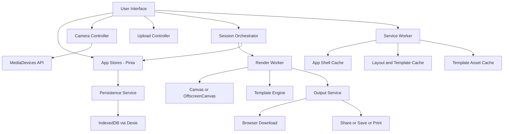
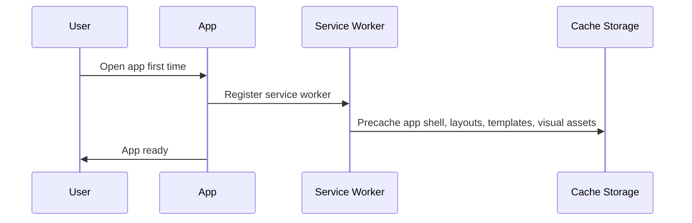
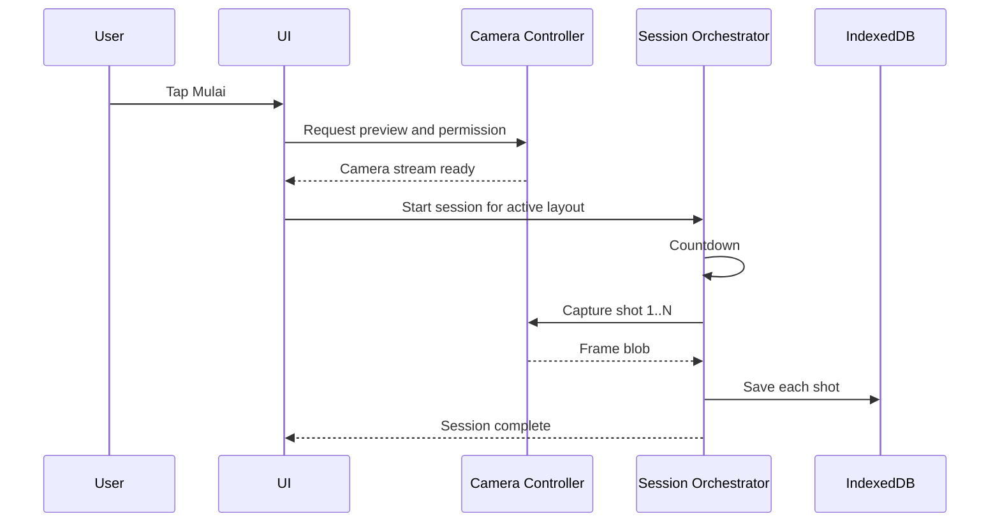
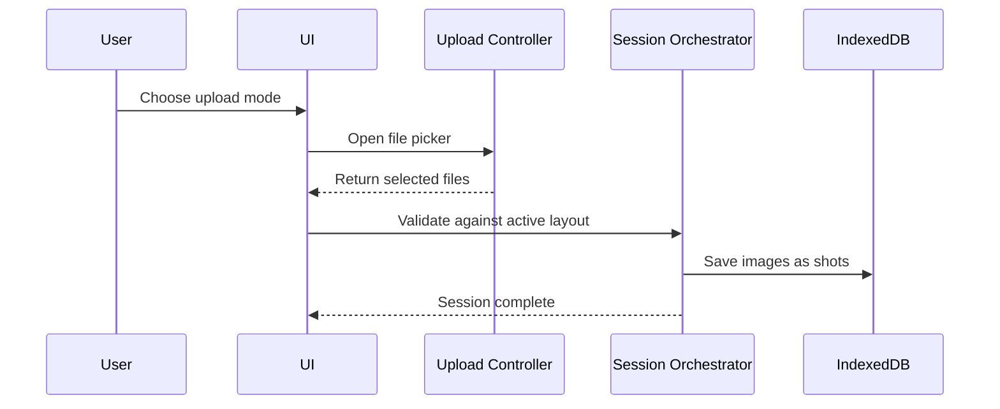
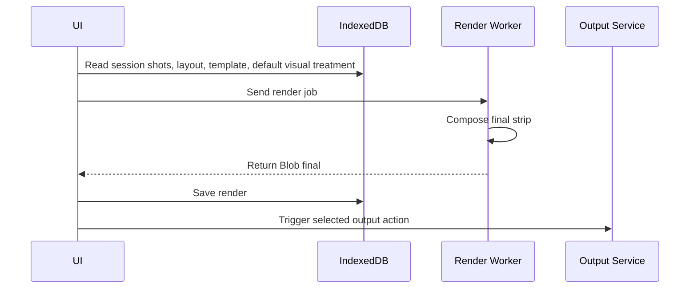

# Rancangan Sistem Teknis - Stecute

Dokumen: Technical System Design  
Versi: 1.2  
Tanggal: 2026-03-20  
Status: Finalized baseline siap implementasi production-ready  
Pemilik dokumen: Engineering Lead / Full-stack Lead

---

## 1. Ringkasan keputusan teknis

### 1.1 Target arsitektur

Aplikasi dibangun sebagai PWA berbasis SPA dengan offline-first architecture. Semua alur inti berjalan di client:

- camera access
- local image upload
- countdown
- multi-shot capture
- layout-driven compositing
- template-driven rendering
- export and output actions
- local persistence

Server tidak menjadi dependency untuk flow inti MVP.

### 1.2 Tech stack yang dipilih

#### Frontend core

- Vue 3
- Vite
- TypeScript
- Vue Router
- Pinia
- Tailwind CSS

#### Offline and persistence

- vite-plugin-pwa
- Workbox
- IndexedDB via Dexie

#### Imaging

- MediaDevices API
- Canvas API
- Web Worker
- OffscreenCanvas jika didukung browser target
- createImageBitmap jika didukung browser target

#### Output and capabilities

- Web Share API bila tersedia
- File System Access API bila tersedia
- window.print untuk print-friendly flow

#### Quality and delivery

- Vitest
- Playwright
- ESLint
- Prettier
- Static hosting via Cloudflare Pages atau Netlify
- Self-hosted WOFF2 font assets untuk production

### 1.3 Decision record

Keputusan utama:

- Tidak memakai SSR karena use case inti adalah local interaction dan camera-heavy flow.
- Tidak memakai login agar friction minimum.
- Tidak bergantung pada backend untuk fitur inti agar offline-first benar-benar terasa.
- PWA dipilih karena paling efisien untuk web installability dan cache offline.
- Format output dan template dibuat data-driven agar varian `2 foto`, `3 foto`, `4 foto`, dan `6 foto` bisa didukung tanpa mengubah core engine.
- Output actions dibuat capability-based agar save, share, dan print hanya muncul bila browser mendukung.
- Tauri diposisikan sebagai extension phase jika nanti dibutuhkan kiosk native atau integrasi OS lebih dalam.

---

## 2. Sasaran teknis

- Fungsi inti tetap berjalan saat offline setelah initial install atau cache.
- Arsitektur mendukung hasil cetak berbasis slot dengan tinggi canvas yang mengikuti jumlah foto.
- Satu engine mendukung dua sumber input: kamera dan upload lokal.
- Template inti dan visual default template tersedia offline tanpa langkah kustomisasi manual.
- Output mendukung download, save, share, dan print dengan capability detection per browser.
- Render tidak membuat UI freeze yang mengganggu.
- Local persistence aman untuk hasil session, gallery, dan konfigurasi device.
- Arsitektur siap naik ke mode event dan optional sync di fase berikutnya.
- Dokumen rinci pendamping adalah `stecute-production-spec.md` dan `stecute-asset-spec.md`.

---

## 3. Cakupan sistem

### In scope MVP

- Web app PWA.
- Local capture engine.
- Local upload pipeline.
- Local render and template engine.
- Local asset cache.
- Local gallery terbatas.
- Output actions berbasis capability.

### Out of scope MVP

- User account.
- Cloud sync wajib.
- Multi-device sync.
- Payment.
- Native print driver.
- QR delivery berbasis server.
- Server-side rendering.
- Kustomisasi manual pasca-capture seperti filter, frame color, sticker, date/time, dan logo text.

---

## 4. Arsitektur tingkat tinggi



Penjelasan:

- UI mengatur flow dan interaksi pengguna.
- Pinia menyimpan state runtime.
- Camera Controller mengelola preview, switch camera, dan permission.
- Upload Controller mengelola file lokal sebagai source alternatif.
- Session Orchestrator membaca layout aktif dan menjalankan sesi sesuai jumlah slot.
- Render Worker menyusun hasil akhir dan visual template di background thread bila tersedia.
- Output Service memutuskan action yang didukung browser: download, save, share, atau print.
- Persistence Service menyimpan session, render, layout choice, dan gallery lokal ke IndexedDB.
- Service Worker mengelola app shell, layout, template, dan asset offline.

---

## 5. Modul utama

### 5.1 App Shell

Tanggung jawab:

- bootstrap aplikasi
- routing dasar
- global layout
- offline banner
- capability banner
- error boundary

Komponen utama:

- `App.vue`
- `router/index.ts`
- `layouts/MainShell.vue`
- `components/common/*`

### 5.2 Camera Controller

Tanggung jawab:

- meminta izin kamera
- memilih device kamera
- menyiapkan stream preview
- menangani error hardware atau permission

API internal utama:

- `initCamera(preferredFacingMode)`
- `switchCamera(deviceId)`
- `stopCamera()`
- `captureFrame(videoEl)`

### 5.3 Upload Controller

Tanggung jawab:

- memilih file gambar lokal
- memvalidasi jumlah file terhadap slot layout
- membuat preview dan metadata file

API internal utama:

- `openImagePicker()`
- `validateSelection(files, slotCount)`
- `loadImageFiles(files)`

### 5.4 Session Orchestrator

Tanggung jawab:

- membaca jumlah slot dari layout aktif
- mengatur countdown
- menentukan jumlah shot
- mendukung camera capture dan upload session
- menyimpan raw frame ke state dan database

State inti:

- idle
- ready
- configuring
- capturing
- uploading
- reviewing
- rendering
- completed
- error

### 5.5 Render Engine

Tanggung jawab:

- crop dan scale frame sesuai layout
- compositing frame ke canvas output
- menggambar background template, photo backing, label, margin, dan visual default template
- mengekspor Blob final

Implementasi:

- worker-based rendering untuk mengurangi blocking di main thread
- fallback ke main thread jika worker atau OffscreenCanvas tidak tersedia

### 5.6 Persistence Service

Tanggung jawab:

- simpan settings lokal
- simpan metadata session
- simpan hasil render
- simpan gallery lokal
- hapus data session saat reset

Teknologi:

- Dexie di atas IndexedDB

### 5.7 Output Service

Tanggung jawab:

- memutuskan output action yang tersedia
- trigger browser download
- trigger save file flow bila tersedia
- trigger native share sheet bila tersedia
- trigger print-friendly flow

### 5.8 Service Worker Layer

Tanggung jawab:

- precache app shell
- cache layout, template, dan asset visual template inti
- cache strategi runtime terbatas
- support offline fallback untuk route aplikasi

---

## 6. Struktur folder yang direkomendasikan

```text
src/
  app/
    router/
    store/
    providers/
  features/
    landing/
    camera/
    upload/
    session-config/
    countdown/
    capture/
    review/
    renderer/
    output/
    gallery/
    reset-session/
    event-mode/
  components/
    common/
    layout/
  services/
    camera/
    upload/
    render/
    output/
    storage/
    cache/
    capability/
  workers/
    render.worker.ts
  assets/
    templates/
    frames/
    fonts/
  layouts/
    strip-2/
    strip-3/
    strip-4/
    strip-6/
  templates/
    classic/
    youth/
    monochrome/
  db/
    schema.ts
    repositories/
  utils/
  styles/
public/
  icons/
  manifest/
```

Catatan:

- Feature-driven structure dipilih agar alur capture tidak bercampur dengan concern umum.
- Layout disimpan terpisah dari template agar jumlah slot tidak melekat ke visual style.
- Asset visual template dibundel sebagai bagian aplikasi agar tersedia offline.

---

## 7. Data model lokal

### 7.1 Database schema

Gunakan IndexedDB dengan tabel berikut:

#### `app_settings`

| Field | Type | Keterangan |
|---|---|---|
| key | string | primary key |
| value | json | nilai setting |
| updatedAt | number | epoch ms |

Contoh isi:

- preferredCameraId
- countdownSeconds
- soundEnabled
- selectedLayoutId
- selectedTemplateId
- galleryRetentionLimit

#### `sessions`

| Field | Type | Keterangan |
|---|---|---|
| id | string | session id via `crypto.randomUUID()` |
| status | string | idle, completed, discarded |
| captureSource | string | camera atau upload |
| layoutId | string | layout aktif |
| templateId | string | template aktif |
| slotCount | number | jumlah frame untuk sesi |
| decorationConfig | json | visual treatment default dari template; field kustomisasi manual disiapkan untuk fase berikutnya |
| startedAt | number | epoch ms |
| completedAt | number | epoch ms nullable |
| finalRenderId | string | relasi hasil akhir |

#### `shots`

| Field | Type | Keterangan |
|---|---|---|
| id | string | shot id |
| sessionId | string | relasi session |
| order | number | urutan 1..N |
| sourceType | string | camera atau upload |
| blob | Blob | frame image; boleh memakai fallback ArrayBuffer internal bila browser gagal menulis Blob ke IndexedDB |
| width | number | pixel |
| height | number | pixel |
| createdAt | number | epoch ms |

#### `renders`

| Field | Type | Keterangan |
|---|---|---|
| id | string | render id |
| sessionId | string | relasi session |
| mimeType | string | image/png atau image/jpeg |
| variant | string | default, print, share |
| blob | Blob | hasil akhir; boleh memakai fallback ArrayBuffer internal bila browser gagal menulis Blob ke IndexedDB |
| width | number | pixel |
| height | number | pixel |
| sizeBytes | number | ukuran file |
| createdAt | number | epoch ms |
| savedToDeviceAt | number | epoch ms nullable |

#### `layouts`

| Field | Type | Keterangan |
|---|---|---|
| id | string | layout id |
| name | string | nama layout |
| slotCount | number | 2, 3, 4, atau 6 |
| aspectRatio | string | contoh 6x2-strip |
| config | json | slot layout config |
| isBundled | boolean | asset bawaan |
| updatedAt | number | epoch ms |

#### `templates`

| Field | Type | Keterangan |
|---|---|---|
| id | string | template id |
| name | string | nama template |
| version | string | versi asset |
| config | json | visual config |
| isBundled | boolean | asset bawaan |
| updatedAt | number | epoch ms |

#### `assets`

| Field | Type | Keterangan |
|---|---|---|
| id | string | asset id |
| type | string | frame, overlay, template-preview, future-sticker, future-filter-preview |
| name | string | nama asset |
| path | string | lokasi asset lokal |
| packId | string | grup asset |
| isBundled | boolean | asset bawaan |
| updatedAt | number | epoch ms |

#### `event_presets`

Catatan:

- Tabel ini disiapkan untuk fase berikutnya dan tidak menjadi implementasi wajib v1.

| Field | Type | Keterangan |
|---|---|---|
| id | string | preset id |
| name | string | nama preset |
| layoutId | string | layout default |
| templateId | string | template default |
| decorationConfig | json | default visual treatment template |
| autoResetEnabled | boolean | reset otomatis |
| updatedAt | number | epoch ms |

### 7.2 Retention policy

- Simpan default 10 render terakhir.
- Saat batas terlampaui, hapus data render dan shot paling lama.
- Session yang belum selesai lebih dari 24 jam dapat dibersihkan saat startup.
- Raw shots yang sudah berhasil dirender dibersihkan setelah session selesai atau reset.

---

## 8. Desain layout and template engine

Layout dan template harus diperlakukan sebagai data, bukan logic hard-coded.

### 8.1 Pemisahan concern

- Layout menentukan jumlah slot, ukuran canvas, dan posisi frame.
- Template menentukan visual treatment yang harus terlihat jelas tetapi natural: blanko/background, surface, accent, default frame color, text style, dan photo treatment.
- V1 process-first tidak mengekspos decoration layer yang dapat diedit user; renderer memakai visual default dari template.

### 8.2 Contoh struktur config layout

```json
{
  "id": "strip-3-vertical",
  "name": "3 Foto",
  "slotCount": 3,
  "canvas": { "width": 1200, "height": 2740 },
  "slots": [
    { "x": 60, "y": 60, "width": 1080, "height": 810, "radius": 0 },
    { "x": 60, "y": 890, "width": 1080, "height": 810, "radius": 0 },
    { "x": 60, "y": 1720, "width": 1080, "height": 810, "radius": 0 }
  ]
}
```

### 8.3 Contoh struktur config template

```json
{
  "id": "classic",
  "name": "Classic",
  "background": "#ffffff",
  "surfaceColor": "#ffffff",
  "accentColor": "#111111",
  "textColor": "#111111",
  "blanko": {
    "mode": "generated",
    "backgroundImage": null,
    "pattern": "paper",
    "photoPadding": 0,
    "photoRadius": 0,
    "photoShadow": false
  },
  "frameAsset": "/assets/frames/classic.png",
  "defaultFrameColor": "#ffffff",
  "label": {
    "text": "",
    "fontSize": 104,
    "align": "center"
  },
  "footerLogo": "/icons.svg",
  "supports": {
    "stickers": false,
    "frameColor": false,
    "dateTime": false,
    "logoText": false
  }
}
```

### 8.4 Aturan engine

- Layout menentukan jumlah slot: 2, 3, 4, atau 6.
- Semua asset template, frame default, dan overlay inti harus precache.
- Template tidak boleh memuat script eksternal.
- Template boleh memakai blanko image lokal/bundled di fase berikutnya; renderer harus fallback ke generated blanko bila image belum ada.
- Flow v1 memakai template default Classic; template lain tidak perlu ditampilkan sebagai pilihan pengguna.
- Perubahan layout baru cukup menambah config dan asset.
- Perubahan template baru cukup menambah config dan asset.
- Font produksi harus self-hosted dan tidak boleh bergantung pada Google Fonts atau CDN lain.

---

## 9. Alur teknis utama

### 9.1 First install and cache warm-up



Catatan:

- Offline penuh baru tersedia setelah service worker aktif dan asset inti sudah masuk cache.
- Initial load tetap membutuhkan internet.

### 9.2 Capture session



### 9.3 Upload local images session



### 9.4 Render and output



---

## 10. State management design

Gunakan Pinia untuk state runtime. Bagi state menjadi beberapa store.

### `useAppStore`

- appReady
- offlineMode
- installPromptAvailable

### `useCapabilityStore`

- canShare
- canPrint
- canSaveFile
- canUseOffscreenCanvas
- canUseImageBitmap
- supportedInputModes

### `useCameraStore`

- permissionState
- activeDeviceId
- availableDevices
- streamReady
- previewAspectRatio

### `useSessionStore`

- sessionId
- sessionStatus
- captureSource
- layoutId
- templateId
- countdownSeconds
- slotCount
- currentShotIndex
- shotIds
- renderId

### `useGalleryStore`

- recentRenders
- storageUsageEstimate

Aturan:

- Data yang harus bertahan reload disimpan ke IndexedDB.
- Pinia hanya untuk runtime state dan hydration ringan.

---

## 11. Offline strategy

### 11.1 Cache categories

#### Precache

- `index.html`
- JS and CSS bundles
- manifest
- app icons
- bundled layouts
- bundled template config
- frame PNG atau SVG inti
- offline fallback assets
- print stylesheet

#### Runtime cache

- font lokal self-hosted
- image asset tambahan yang aman dicache
- optional future template packs

### 11.2 Workbox strategy

- App shell: precache
- Layout and template assets: cache-first
- Template visual assets: cache-first
- Navigation requests: network-first with offline fallback atau app-shell fallback tergantung hosting
- Remote optional APIs di fase depan: stale-while-revalidate atau network-first sesuai jenis data

### 11.3 Update policy

- Tampilkan notifikasi "versi baru tersedia" setelah service worker mendapat update.
- Jangan force refresh saat user sedang dalam session capture, review, render, atau output.
- Update hanya diterapkan saat session idle atau saat user menyetujui reload.

---

## 12. Camera and media design

### 12.1 Constraints default

Gunakan constraints adaptif, contoh:

```ts
{
  video: {
    facingMode: "user",
    width: { ideal: 1280 },
    height: { ideal: 720 }
  },
  audio: false
}
```

### 12.2 Fallback strategy

- Jika `facingMode` gagal, enumerasi device dan tampilkan pilihan kamera.
- Jika resolusi ideal tidak tersedia, fallback ke kemampuan device.
- Jika kamera tidak ada, tampilkan unsupported state dan tawarkan upload lokal.

### 12.3 Upload constraints

- format yang diterima: `image/jpeg`, `image/png`, `image/webp`
- ukuran file maksimum: `10 MB` per file
- jumlah file maksimum: `6` per sesi
- metadata orientation harus dinormalisasi saat decode

### 12.4 Capture pipeline

1. Preview stream ke elemen video.
2. Saat capture, crop frame tengah ke rasio foto landscape `4:3`.
3. Draw frame hasil crop ke canvas sementara.
4. Ekspor frame sebagai Blob.
5. Simpan ke IndexedDB.
6. Lanjut shot berikutnya sesuai slot layout.

### 12.5 Orientation handling

- Layout default dioptimalkan untuk portrait strip.
- Preview kamera produksi memakai framing `4:3` agar tidak terlihat terlalu gepeng di desktop.
- Preview dapat menyesuaikan ratio device untuk fallback browser atau device yang tidak mendukung constraint ideal.
- Jika mobile landscape terjadi, tampilkan hint orientasi terbaik.

---

## 13. Render and output design

### 13.1 Prinsip

- Render deterministik berdasarkan layout config + template config + shot list + visual treatment default dari template.
- Semua operasi berat dipindahkan ke worker jika memungkinkan.
- Hasil akhir v1 memakai PNG sebagai satu-satunya pilihan yang ditampilkan.
- Dukungan JPG boleh tetap tersedia di level render/storage untuk kompatibilitas atau fase berikutnya, tetapi tidak menjadi pilihan pengguna di flow output v1.

### 13.2 Tahapan render

1. Load layout config.
2. Load template config.
3. Load shot blobs.
4. Decode image bitmap.
5. Crop dan fit ke slot.
6. Gambar background.
7. Gambar slot 1..N.
8. Terapkan background template, photo backing, label template, dan frame default template.
9. Ekspor Blob final.

### 13.3 Output actions

1. Simpan Blob final ke IndexedDB.
2. Jika user memilih download, trigger browser download.
3. Jika browser mendukung file save picker, tawarkan save to device.
4. Jika browser mendukung Web Share, kirim file via native share sheet.
5. Jika browser mendukung print flow, buka print-friendly view.

Ukuran baseline output:

- `2 foto`: `1200 x 1910`
- `3 foto`: `1200 x 2740`
- `4 foto`: `1200 x 3570`
- `6 foto`: `1200 x 5230`

Tinggi canvas mengikuti jumlah foto agar export tidak menyisakan kertas kosong berlebihan.

Aturan tambahan:

- gunakan penamaan file `stecute-YYYYMMDD-HHmmss-layout-template.ext`
- print flow wajib punya stylesheet khusus
- jika browser mengabaikan print background, tampilkan warning singkat sebelum `window.print`

### 13.4 Performance notes

- Gunakan `createImageBitmap` bila tersedia.
- Hindari base64 sebagai format penyimpanan utama; pilih Blob.
- Jika browser tertentu gagal menyimpan Blob/File ke IndexedDB, persistence layer boleh retry sebagai ArrayBuffer binary dan mengembalikannya sebagai Blob di API aplikasi.
- Hindari render ulang penuh bila hanya preview UI berubah.
- Batasi kompleksitas template aktif untuk device lemah jika perlu.

---

## 14. Security dan privacy design

### 14.1 Privacy by default

- Foto tidak diunggah otomatis.
- Semua hasil disimpan lokal secara default.
- Tidak ada akun dan identitas personal pada MVP.
- Trust copy di landing dan onboarding harus konsisten dengan perilaku teknis.

### 14.2 Permission management

- Kamera hanya diminta saat user menekan flow yang relevan.
- Jika izin ditolak, tampilkan langkah recovery sesuai browser.

### 14.3 Frontend hardening

- Gunakan HTTPS pada semua environment non-local.
- Content Security Policy ketat.
- Hindari remote script pihak ketiga yang tidak penting.
- Asset template dibundel atau divalidasi hash.
- Gunakan `Permissions-Policy` untuk membatasi camera ke origin sendiri.
- Font produksi wajib self-hosted.
- Jika input teks kustom diaktifkan pada fase berikutnya, teks harus disanitasi dan dibatasi maksimum 24 karakter.

### 14.4 Data deletion

- Tombol reset session menghapus state session aktif.
- Menu gallery memberi opsi hapus render tertentu atau semua render lokal.

---

## 15. Error handling

### Error group utama

1. `CAMERA_PERMISSION_DENIED`
2. `CAMERA_NOT_FOUND`
3. `CAMERA_STREAM_FAILED`
4. `UPLOAD_SELECTION_INVALID`
5. `CAPTURE_FAILED`
6. `RENDER_FAILED`
7. `STORAGE_QUOTA_EXCEEDED`
8. `UNSUPPORTED_BROWSER`
9. `OUTPUT_ACTION_UNAVAILABLE`

### Prinsip UX error

- Pesan harus bisa dimengerti non-teknis.
- Beri aksi lanjut yang jelas: coba lagi, ganti kamera, upload foto, hapus gallery, buka setting browser.
- Hindari dead end.

---

## 16. Observability dan analytics

MVP tidak wajib memakai telemetry berat. Analytics remote default `off` untuk rilis awal publik dan hanya boleh diaktifkan untuk event non-image.

### Event yang penting

- app_open
- service_worker_ready
- camera_permission_granted
- camera_permission_denied
- upload_mode_selected
- session_started
- shot_captured
- render_completed
- render_failed
- output_action_clicked
- download_completed
- offline_session_completed

Aturan:

- Jangan kirim metadata foto atau konten gambar.
- Jika analytics remote diaktifkan di fase depan, harus bersifat opt-in atau minimalis.

---

## 17. Testing strategy

### 17.1 Unit tests

Cakupan:

- layout config parser
- countdown logic
- render math untuk crop dan fit
- default template treatment config
- state transitions session store
- storage repository

### 17.2 Integration tests

Cakupan:

- init camera flow dengan mock media devices
- capture dynamic shot sequence
- upload image flow
- save and read from IndexedDB
- reset session behavior

### 17.3 E2E tests

Gunakan Playwright untuk:

- first launch
- permission denied flow
- successful camera capture flow
- successful upload flow
- offline relaunch setelah cache
- export flow
- capability-based output visibility

### 17.4 Manual QA matrix

- Chrome desktop
- Chrome Android
- Safari iPhone atau iPad
- Edge desktop
- Tablet Android
- Firefox modern best-effort

---

## 18. Performance budget

Target awal:

- JS initial bundle ideal < 300 KB gzip untuk shell utama di luar asset template.
- App shell interactive < 3 detik pada koneksi normal.
- Worker render final < 2 detik pada laptop menengah.
- Worker render final < 4 detik pada mobile menengah.
- Local storage cleanup < 1 detik untuk 10 render.
- Total bundled visual asset awal target < 8 MB.

Optimasi:

- lazy load feature yang tidak dipakai saat startup
- split layout previews
- gunakan image asset yang sudah dioptimasi
- preload hanya layout dan template default saat awal

---

## 19. Browser support policy

Target utama:

- Chrome desktop 2 versi mayor terakhir
- Edge desktop 2 versi mayor terakhir
- Chrome Android 2 versi mayor terakhir
- Safari iOS atau iPadOS 2 versi mayor terakhir

Catatan:

- PWA installability dan beberapa capability berbeda antar browser.
- OffscreenCanvas tidak boleh dijadikan hard dependency.
- Fallback main-thread rendering harus tersedia.
- Save, share, dan print harus capability-based, bukan diasumsikan tersedia.
- Firefox modern didukung best-effort.

---

## 20. Deployment architecture

### MVP deployment

- Static hosting di Cloudflare Pages atau Netlify, dengan Cloudflare Pages sebagai default.
- CI build menghasilkan asset fingerprinted.
- Service worker versioning mengikuti hash build.

### Pipeline

1. Commit ke main branch.
2. Jalankan lint, typecheck, unit tests, integration tests, build.
3. Jalankan basic Playwright smoke test.
4. Deploy preview.
5. Promote static assets ke production.
6. Service worker baru aktif dengan update prompt.

Rollback:

- simpan minimal satu build production sebelumnya
- rollback dilakukan dengan redeploy build sebelumnya
- jika bug terkait service worker, bump versi service worker dan terapkan refresh saat app idle

---

## 21. Future-ready extension architecture

Meskipun MVP tidak memerlukan backend, siapkan antarmuka layanan agar mudah ditambah nanti.

### Service contracts yang disarankan

- `LayoutRepository`
- `TemplateRepository`
- `RenderRepository`
- `OutputActionService`
- `EventPresetRepository`
- `SyncQueueService`
- `AnalyticsService`

Dengan pola ini, implementasi awal cukup local-only. Pada fase berikutnya, adapter remote bisa ditambahkan tanpa merombak domain inti.

### Fase lanjutan yang mungkin

- Optional template sync dari CDN.
- Upload queue ketika online kembali.
- Event branding profile.
- QR handoff.
- Auto-reset timer.
- Idle screen state.
- Tauri wrapper untuk kiosk dan file system integration yang lebih kuat.

---

## 22. Rencana implementasi engineering

### Sprint 1

- bootstrap project
- routing dasar
- UI shell
- camera permission and preview
- session store
- capability detection

### Sprint 2

- layout engine
- countdown
- dynamic multi-shot capture
- upload lokal flow
- save raw shots ke IndexedDB
- basic review screen

### Sprint 3

- template engine v1
- template renderer v1
- worker render
- output actions: download and save
- reset session

### Sprint 4

- PWA and service worker
- offline test pass
- gallery lokal terbatas
- capability-based share and print
- browser QA and bugfix

---

## 23. Definition of done teknis

Implementasi MVP dianggap selesai jika:

- App dapat diinstal sebagai PWA.
- App shell, layout, template, dan asset visual template inti tersedia offline setelah initial load.
- Capture dinamis sesuai slot layout berjalan stabil di browser target utama.
- Upload lokal berjalan tanpa backend.
- Render final berjalan dengan fallback yang aman.
- Hasil dapat diunduh atau disimpan tanpa backend.
- Session dan hasil terakhir tersimpan lokal.
- Output action yang tidak didukung browser ditangani dengan aman.
- Error handling utama lulus QA.
- Smoke test offline relaunch lulus.
- Font produksi tidak lagi bergantung pada remote Google Fonts.
- Browser target utama lulus QA dasar.
