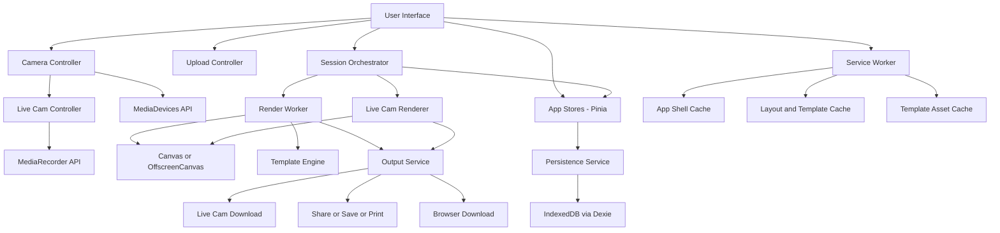
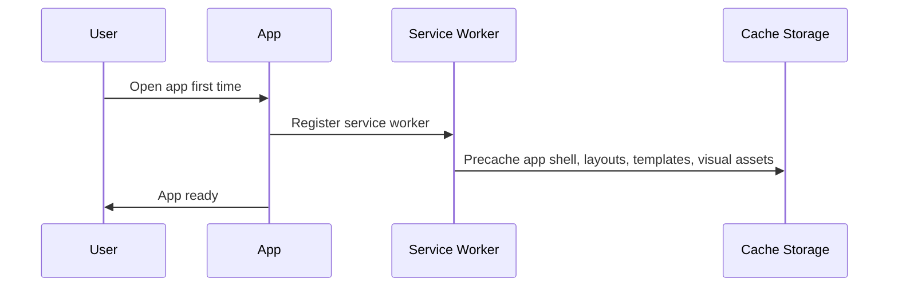
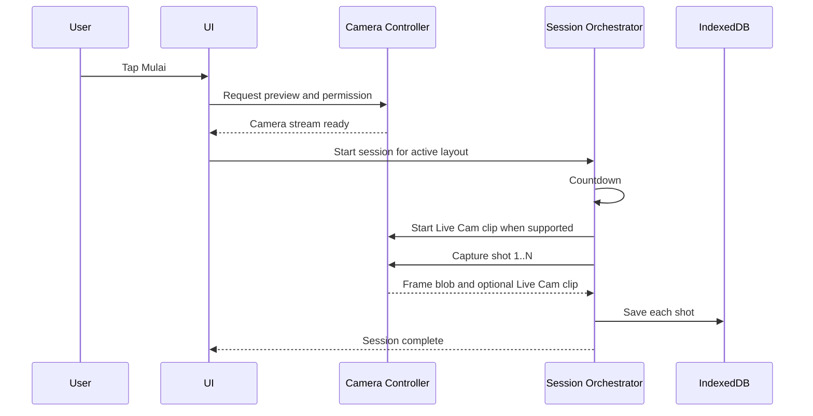
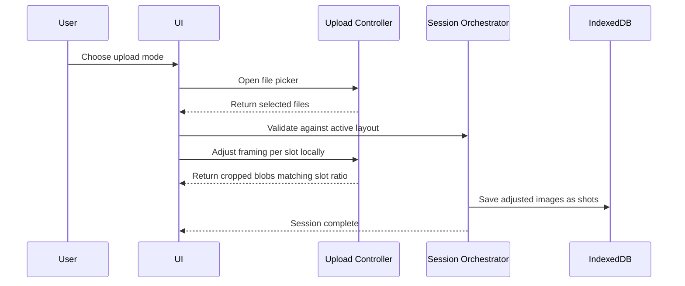
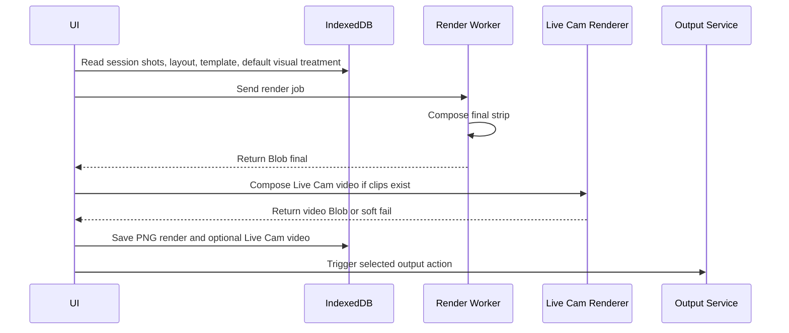

# Rancangan Sistem Teknis - Stecute

Dokumen: Technical System Design  
Versi: 1.4  
Tanggal: 2026-09-04  
Status: Finalized baseline siap implementasi production-ready  
Pemilik dokumen: Engineering Lead / Full-stack Lead

---

## 1. Ringkasan keputusan teknis

### 1.1 Target arsitektur

Aplikasi dibangun sebagai PWA berbasis SPA dengan offline-first architecture. Semua alur inti berjalan di client:

- camera access
- local image upload
- countdown
- multi-shot capture
- layout-driven compositing
- template-driven rendering
- export and output actions
- local persistence

Server tidak menjadi dependency untuk flow inti MVP.

### 1.2 Tech stack yang dipilih

#### Frontend core

- Vue 3
- Vite
- TypeScript
- Vue Router
- Pinia
- Tailwind CSS

#### Offline and persistence

- vite-plugin-pwa
- Workbox
- IndexedDB via Dexie

#### Imaging

- MediaDevices API
- MediaRecorder API untuk Live Cam bila tersedia
- Canvas API
- Web Worker
- OffscreenCanvas jika didukung browser target
- createImageBitmap jika didukung browser target

#### Output and capabilities

- Web Share API bila tersedia
- File System Access API bila tersedia
- window.print untuk print-friendly flow
- Canvas capture stream untuk output Live Cam bila tersedia

#### Quality and delivery

- Vitest
- Playwright
- ESLint
- Prettier
- Static hosting via Cloudflare Pages atau Netlify
- Self-hosted WOFF2 font assets untuk production

### 1.3 Decision record

Keputusan utama:

- Tidak memakai SSR karena use case inti adalah local interaction dan camera-heavy flow.
- Tidak memakai login agar friction minimum.
- Tidak bergantung pada backend untuk fitur inti agar offline-first benar-benar terasa.
- PWA dipilih karena paling efisien untuk web installability dan cache offline.
- Format output dan template dibuat data-driven agar varian standar `2 foto`, `3 foto`, `4 foto`, dan `6 foto` serta template-defined layout bisa didukung tanpa mengubah core engine.
- Output actions dibuat capability-based agar save, share, dan print hanya muncul bila browser mendukung.
- Tauri diposisikan sebagai extension phase jika nanti dibutuhkan kiosk native atau integrasi OS lebih dalam.

---

## 2. Sasaran teknis

- Fungsi inti tetap berjalan saat offline setelah initial install atau cache.
- Arsitektur mendukung hasil cetak berbasis slot dengan tinggi canvas yang mengikuti jumlah foto.
- Satu engine mendukung dua sumber input: kamera dan upload lokal.
- Template inti dan visual default template tersedia offline tanpa langkah kustomisasi manual.
- Output mendukung download, save, share, dan print dengan capability detection per browser.
- Render tidak membuat UI freeze yang mengganggu.
- Local persistence aman untuk hasil session, gallery, dan konfigurasi device.
- Arsitektur siap naik ke mode event dan optional sync di fase berikutnya.
- Dokumen rinci pendamping adalah `stecute-production-spec.md` dan `stecute-asset-spec.md`.

---

## 3. Cakupan sistem

### In scope MVP

- Web app PWA.
- Local capture engine.
- Local upload pipeline.
- Local render and template engine.
- Local asset cache.
- Local gallery terbatas.
- Output actions berbasis capability.
- Booth Bareng opsional: identitas kode/undangan, transport signaling yang bisa diganti, countdown 2 peer, komposisi pair-row, tanpa dependency pada alur session lokal.

### Out of scope MVP

- User account.
- Cloud sync wajib.
- Multi-device sync sebagai syarat alur lokal.
- Payment.
- Native print driver.
- QR delivery berbasis server.
- Server-side rendering.
- Kustomisasi manual pasca-capture seperti frame color, sticker, date/time, dan logo text.
- Audio, 3+ peserta, TURN berbayar sebagai syarat rilis, atau retensi still di server untuk Booth Bareng.

---

## 4. Arsitektur tingkat tinggi


```mermaid
flowchart TD
    A[User Interface] --> B[App Stores - Pinia]
    A --> C[Camera Controller]
    A --> D[Upload Controller]
    C --> E[MediaDevices API]
    C --> V[Live Cam Controller]
    V --> W[MediaRecorder API]
    A --> F[Session Orchestrator]
    F --> G[Render Worker]
    F --> X[Live Cam Renderer]
    G --> H[Canvas or OffscreenCanvas]
    G --> I[Template Engine]
    X --> H
    F --> B
    G --> J[Output Service]
    X --> J
    J --> K[Browser Download]
    J --> L[Share or Save or Print]
    J --> Y[Live Cam Download]
    B --> M[Persistence Service]
    M --> N[IndexedDB via Dexie]
    O[Service Worker] --> P[App Shell Cache]
    O --> Q[Layout and Template Cache]
    O --> R[Template Asset Cache]
    A --> O
```

Penjelasan:

- UI mengatur flow dan interaksi pengguna.
- Pinia menyimpan state runtime.
- Camera Controller mengelola preview, switch camera, dan permission.
- Live Cam Controller merekam klip singkat per-shot secara lokal jika browser mendukung `MediaRecorder`.
- Upload Controller mengelola file lokal sebagai source alternatif.
- Session Orchestrator membaca layout aktif dan menjalankan sesi sesuai jumlah slot.
- Render Worker menyusun hasil akhir dan visual template di background thread bila tersedia.
- Live Cam Renderer membuat video strip bergerak dari klip per-shot memakai canvas capture stream bila capability tersedia.
- Output Service memutuskan action yang didukung browser: download, save, share, atau print.
- Persistence Service menyimpan session, render, layout choice, dan gallery lokal ke IndexedDB.
- Service Worker mengelola app shell, layout, template, dan asset offline.

---

## 5. Modul utama

### 5.1 App Shell

Tanggung jawab:

- bootstrap aplikasi
- routing dasar
- global layout
- offline banner
- capability banner
- error boundary

Komponen utama:

- `App.vue`
- `router/index.ts`
- `layouts/MainShell.vue`
- `components/common/*`

### 5.2 Camera Controller

Tanggung jawab:

- meminta izin kamera
- memilih device kamera
- menyiapkan stream preview
- menangani error hardware atau permission
- mengganti latar ruangan (warna studio, blur, atau gambar unggahan lokal) di preview dan still capture lewat segmentasi orang lokal; gagal tertutup ke frame asli
- memberi stream yang sama ke Live Cam Controller saat capability tersedia

API internal utama:

- `initCamera(preferredFacingMode)`
- `switchCamera(deviceId)`
- `stopCamera()`
- `captureFrame(videoEl)`

### 5.3 Live Cam Controller

Tanggung jawab:

- mendeteksi dukungan `MediaRecorder` untuk stream kamera aktif
- merekam klip singkat lokal per-shot selama countdown/capture
- menyimpan metadata video seperti mime type, durasi, dimensi, dan status mirror kamera
- menghentikan rekaman saat countdown dibatalkan, retake, reset, atau komponen kamera keluar
- gagal secara lunak agar capture foto statis tetap berhasil

API internal utama:

- `isLiveCamRecordingSupported(stream)`
- `startLiveCamRecording(stream, options)`
- `renderLiveStrip(job)`

### 5.4 Upload Controller

Tanggung jawab:

- memilih file gambar lokal
- memvalidasi jumlah file terhadap slot layout
- membuat preview dan metadata file

API internal utama:

- `openImagePicker()`
- `validateSelection(files, slotCount)`
- `loadImageFiles(files)`

### 5.5 Session Orchestrator

Tanggung jawab:

- membaca jumlah slot dari layout aktif
- mengatur countdown
- menentukan jumlah shot
- mendukung camera capture dan upload session
- menyimpan raw frame dan optional Live Cam clip per-shot ke state dan database

State inti:

- idle
- ready
- configuring
- capturing
- uploading
- reviewing
- rendering
- completed
- error

### 5.6 Render Engine

Tanggung jawab:

- crop dan scale frame sesuai layout
- compositing frame ke canvas output
- menggambar background template, photo backing, label, margin, dan visual default template
- mengekspor Blob final
- membuat output Live Cam tambahan dari klip per-shot bila tersedia, memakai layout/template yang sama dalam ukuran video yang dibatasi untuk performa

Implementasi:

- worker-based rendering untuk mengurangi blocking di main thread
- fallback ke main thread jika worker atau OffscreenCanvas tidak tersedia
- Live Cam render berbasis canvas capture stream dan `MediaRecorder`; jika gagal, PNG tetap disimpan

### 5.7 Persistence Service

Tanggung jawab:

- simpan settings lokal
- simpan metadata session
- simpan hasil render PNG dan optional Live Cam video berpasangan
- simpan gallery lokal
- hapus data session saat reset
- hapus raw Live Cam clip per-shot setelah final render selesai

Teknologi:

- Dexie di atas IndexedDB

### 5.8 Output Service

Tanggung jawab:

- memutuskan output action yang tersedia
- trigger browser download
- trigger download Live Cam bila tersedia
- trigger save file flow bila tersedia
- trigger native share sheet bila tersedia
- trigger print-friendly flow

### 5.9 Service Worker Layer

Tanggung jawab:

- precache app shell
- cache layout, template, dan asset visual template inti
- precache runtime face detector lokal, termasuk MediaPipe WASM dan model face detector yang dipakai overlay kamera
- menyediakan runtime image segmenter lokal (`selfie_segmenter.tflite`) untuk latar virtual kamera, tanpa CDN
- cache strategi runtime terbatas
- support offline fallback untuk route aplikasi

### 5.10 Booth Bareng (optional)

Tanggung jawab:

- membuat dan menormalisasi kode ruang (hyphen opsional, case-insensitive)
- membangun URL undangan yang memuat kode yang sama sebagai identitas join
- menolak kode kosong, rusak, atau tidak dikenal
- menjalankan protokol 2 peer: start countdown, tukar still, compose pair-row `host | tamu`
- menyinkronkan setup host termasuk `filterId`, `cameraEffectId`, `virtualBackgroundId`, dan `autoCapture` beserta asset gambar latar virtual kustom bila dipilih host; background pilihan host diterapkan ke kedua peserta
- menyerahkan shot hasil compose ke `renderStrip` yang sudah ada
- tidak menyimpan still di server dan tidak menyentuh session kamera/upload lokal

Transport signaling bersifat swappable: BroadcastChannel untuk tab yang sama, WebRTC/PeerJS dengan STUN (dan TURN publik bila dikonfigurasi), plus mailbox HTTPS ephemeral di origin aplikasi agar 4G vs Wi-Fi kantor tetap bertemu. Payload mailbox terenkripsi dengan kode booth dan tidak disimpan setelah sesi. Tes unit menyuntik dua peer in-process tanpa server publik. WebRTC media (video only) menampilkan preview kehadiran kedua peserta dalam dua kotak `host | tamu` dengan latar virtual lokal masing-masing yang sudah dikomposisikan sebelum ditransmisikan (stream peer diterima dan ditampilkan langsung tanpa segmentasi ulang); data channel dipakai untuk sinkronisasi still, setup, dan asset latar virtual. Preview dan still booth tidak di-mirror. Artefak capture adalah still, bukan rekaman panggilan. Alur kamera dan upload lokal tidak memuat modul ini.

---

## 6. Struktur folder yang direkomendasikan

```text
src/
  app/
    router/
    store/
    providers/
  features/
    landing/
    camera/
    upload/
    session-config/
    countdown/
    capture/
    review/
    renderer/
    output/
    gallery/
    reset-session/
    event-mode/
    booth/
  components/
    common/
    layout/
  services/
    camera/
    upload/
    render/
    output/
    storage/
    cache/
    capability/
    booth/
  workers/
    render.worker.ts
  assets/
    templates/
    frames/
    fonts/
  layouts/
    strip-2/
    strip-3/
    strip-4/
    strip-6/
  templates/
    classic/
    youth/
    monochrome/
  db/
    schema.ts
    repositories/
  utils/
  styles/
public/
  icons/
  manifest/
  vendor/
    mediapipe/
      tasks-vision/
      models/
```

Catatan:

- Feature-driven structure dipilih agar alur capture tidak bercampur dengan concern umum.
- Layout disimpan terpisah dari template agar jumlah slot tidak melekat ke visual style.
- Asset visual template dibundel sebagai bagian aplikasi agar tersedia offline.

---

## 7. Data model lokal

### 7.1 Database schema

Gunakan IndexedDB dengan tabel berikut:

#### `app_settings`

| Field | Type | Keterangan |
|---|---|---|
| key | string | primary key |
| value | json | nilai setting |
| updatedAt | number | epoch ms |

Contoh isi:

- preferredCameraId
- countdownSeconds
- soundEnabled
- selectedLayoutId
- selectedTemplateId
- selectedCameraEffectId
- galleryRetentionLimit

#### `sessions`

| Field | Type | Keterangan |
|---|---|---|
| id | string | session id via `crypto.randomUUID()` |
| status | string | idle, completed, discarded |
| captureSource | string | camera atau upload |
| layoutId | string | layout aktif |
| templateId | string | template aktif |
| slotCount | number | jumlah frame untuk sesi |
| decorationConfig | json | visual treatment default dari template; `filterId`, `cameraEffectId`, dan `virtualBackgroundId` dipakai untuk preset kamera v1 (filter, overlay, dan latar virtual orang-vs-ruangan, bukan kertas/blanko strip); `virtualBackgroundAssetId` menunjuk ke asset gambar unggahan lokal; field kustomisasi manual disiapkan untuk fase berikutnya |
| startedAt | number | epoch ms |
| completedAt | number | epoch ms nullable |
| finalRenderId | string | relasi hasil akhir |

#### `shots`

| Field | Type | Keterangan |
|---|---|---|
| id | string | shot id |
| sessionId | string | relasi session |
| order | number | urutan 1..N |
| sourceType | string | camera atau upload |
| blob | Blob | frame image; boleh memakai fallback ArrayBuffer internal bila browser gagal menulis Blob ke IndexedDB |
| width | number | pixel |
| height | number | pixel |
| faceBounds | json nullable | posisi wajah ternormalisasi saat capture untuk mengunci posisi overlay kamera di review dan render final |
| cameraEffectId | string nullable | overlay aktual per shot bila dibutuhkan; v1 memakai preset overlay stabil dan field ini juga menjaga kompatibilitas untuk fase berikutnya |
| cameraEffectFrameMs | number nullable | fase animasi overlay saat shutter ditekan agar PNG final membekukan frame yang sama |
| createdAt | number | epoch ms |

#### `renders`

| Field | Type | Keterangan |
|---|---|---|
| id | string | render id |
| sessionId | string | relasi session |
| mimeType | string | image/png atau image/jpeg |
| variant | string | default, print, share |
| blob | Blob | hasil akhir; boleh memakai fallback ArrayBuffer internal bila browser gagal menulis Blob ke IndexedDB |
| width | number | pixel |
| height | number | pixel |
| sizeBytes | number | ukuran file |
| createdAt | number | epoch ms |
| savedToDeviceAt | number | epoch ms nullable |

#### `layouts`

| Field | Type | Keterangan |
|---|---|---|
| id | string | layout id |
| name | string | nama layout |
| slotCount | number | jumlah slot; standar v1 2, 3, 4, 6, dan template-defined dapat berbeda |
| aspectRatio | string | contoh 6x2-strip |
| config | json | slot layout config |
| isBundled | boolean | asset bawaan |
| updatedAt | number | epoch ms |

#### `templates`

| Field | Type | Keterangan |
|---|---|---|
| id | string | template id |
| name | string | nama template |
| version | string | versi asset |
| config | json | visual config |
| isBundled | boolean | asset bawaan |
| updatedAt | number | epoch ms |

#### `assets`

| Field | Type | Keterangan |
|---|---|---|
| id | string | asset id |
| type | string | frame, overlay, template-preview, future-sticker, filter-preview, virtual-background |
| name | string | nama asset |
| path | string | lokasi asset lokal (kosong jika berbasis blob IndexedDB) |
| packId | string | grup asset |
| isBundled | boolean | asset bawaan |
| updatedAt | number | epoch ms |
| blob | Blob nullable | payload binary untuk asset dinamis sesi seperti gambar latar virtual unggahan pengguna |
| sessionId | string nullable | relasi session untuk pembersihan otomatis (lifecycle scoped to session) |

#### `event_presets`

Catatan:

- Tabel ini disiapkan untuk fase berikutnya dan tidak menjadi implementasi wajib v1.

| Field | Type | Keterangan |
|---|---|---|
| id | string | preset id |
| name | string | nama preset |
| layoutId | string | layout default |
| templateId | string | template default |
| decorationConfig | json | default visual treatment template |
| autoResetEnabled | boolean | reset otomatis |
| updatedAt | number | epoch ms |

### 7.2 Retention policy

- Simpan default 10 render terakhir.
- Saat batas terlampaui, hapus data render dan shot paling lama.
- Session yang belum selesai lebih dari 24 jam dapat dibersihkan saat startup.
- Raw shots yang sudah berhasil dirender dibersihkan setelah session selesai atau reset.
- Asset gambar latar virtual (`virtual-background`) bersifat session-scoped: otomatis dihapus dari tabel `assets` saat session selesai, saat session di-reset, atau saat session kadaluarsa (> 24 jam) dibersihkan.

---

## 8. Desain layout and template engine

Layout dan template harus diperlakukan sebagai data, bukan logic hard-coded.

### 8.1 Pemisahan concern

- Layout menentukan jumlah slot, ukuran canvas, dan posisi frame.
- Template menentukan visual treatment yang harus terlihat jelas tetapi natural: blanko/background, surface, accent, default frame color, text style, dan photo treatment.
- V1 process-first tidak mengekspos decoration layer yang dapat diedit user; renderer memakai visual default dari template.
- Preset overlay kamera adalah konfigurasi sebelum capture (`cameraEffectId`) dan bukan editor sticker manual pasca-capture.

### 8.2 Contoh struktur config layout

```json
{
  "id": "strip-3-vertical",
  "name": "3 Foto",
  "slotCount": 3,
  "canvas": { "width": 1200, "height": 2740 },
  "slots": [
    { "x": 60, "y": 60, "width": 1080, "height": 810, "radius": 0 },
    { "x": 60, "y": 890, "width": 1080, "height": 810, "radius": 0 },
    { "x": 60, "y": 1720, "width": 1080, "height": 810, "radius": 0 }
  ]
}
```

### 8.3 Contoh struktur config template

```json
{
  "id": "classic",
  "name": "Classic",
  "background": "#ffffff",
  "surfaceColor": "#ffffff",
  "accentColor": "#111111",
  "textColor": "#111111",
  "blanko": {
    "mode": "generated",
    "backgroundImage": null,
    "imageLayer": "overlay",
    "imageFit": "stretch",
    "pattern": "paper",
    "photoPadding": 0,
    "photoRadius": 0,
    "photoShadow": false
  },
  "supportedLayoutIds": ["strip-2-vertical", "strip-3-vertical", "strip-4-vertical", "strip-6-vertical"],
  "layoutOverrides": {},
  "frameAsset": "/assets/frames/classic.png",
  "defaultFrameColor": "#ffffff",
  "label": {
    "text": "",
    "fontSize": 104,
    "align": "center"
  },
  "footerLogo": "/icons.svg",
  "supports": {
    "stickers": false,
    "frameColor": false,
    "dateTime": false,
    "logoText": false
  }
}
```

### 8.4 Aturan engine

- Layout menentukan jumlah slot. Layout standar tetap 2, 3, 4, dan 6; blanko/template boleh membawa native layout dengan jumlah slot berbeda.
- Semua asset template, frame default, dan overlay inti harus precache.
- Template tidak boleh memuat script eksternal.
- Template boleh memakai blanko image lokal/bundled; renderer harus fallback ke generated blanko bila image belum ada.
- Blanko raster yang memiliki artboard atau slot berbeda dari layout dasar wajib mendefinisikan `layoutOverrides` per `layoutId`. UI hanya menampilkan paket blanko yang memiliki pasangan layout/template valid.
- Blanko raster yang tidak cocok dengan layout standar sebaiknya mendefinisikan `nativeLayout`, sehingga muncul sebagai paket blanko sendiri dengan jumlah slot bawaan template.
- Untuk blanko PNG dengan lubang transparan di area foto, renderer menggambar foto lebih dulu lalu menggambar blanko sebagai `overlay`, agar dekorasi foreground tidak tertutup foto.
- Custom blanko upload dibuat sebagai runtime template lokal. App membaca alpha channel untuk mendeteksi connected component transparan, mengabaikan area transparan yang menyentuh tepi artboard, lalu membuat native layout dengan `slotCount` dari jumlah window yang ditemukan.
- Runtime custom template memakai object URL saat dirender, tetapi asset asli dan config template disimpan di IndexedDB sebagai template lokal reusable. Saat app dimuat ulang, asset Blob dibuat ulang menjadi object URL baru. Template ini tidak menjadi dependency backend dan tidak tersedia antar perangkat tanpa sinkronisasi terpisah.
- Flow v1 memakai `Classic` sebagai default, tetapi boleh menampilkan pilihan template bundled sebelum capture selama tidak menambah langkah kustomisasi pasca-capture.
- Perubahan layout baru cukup menambah config dan asset.
- Perubahan template baru cukup menambah config dan asset.
- Font produksi harus self-hosted dan tidak boleh bergantung pada Google Fonts atau CDN lain.

---

## 9. Alur teknis utama

### 9.1 First install and cache warm-up


```mermaid
sequenceDiagram
    participant U as User
    participant A as App
    participant SW as Service Worker
    participant C as Cache Storage

    U->>A: Open app first time
    A->>SW: Register service worker
    SW->>C: Precache app shell, layouts, templates, visual assets
    A->>U: App ready
```

Catatan:

- Offline penuh baru tersedia setelah service worker aktif dan asset inti sudah masuk cache.
- Initial load tetap membutuhkan internet.

### 9.2 Capture session


```mermaid
sequenceDiagram
    participant U as User
    participant UI as UI
    participant CAM as Camera Controller
    participant ORC as Session Orchestrator
    participant DB as IndexedDB

    U->>UI: Tap Mulai
    UI->>CAM: Request preview and permission
    CAM-->>UI: Camera stream ready
    UI->>ORC: Start session for active layout
    ORC->>ORC: Countdown
    ORC->>CAM: Start Live Cam clip when supported
    ORC->>CAM: Capture shot 1..N
    CAM-->>ORC: Frame blob and optional Live Cam clip
    ORC->>DB: Save each shot
    ORC-->>UI: Session complete
```

### 9.3 Upload local images session


```mermaid
sequenceDiagram
    participant U as User
    participant UI as UI
    participant UP as Upload Controller
    participant ORC as Session Orchestrator
    participant DB as IndexedDB

    U->>UI: Choose upload mode
    UI->>UP: Open file picker
    UP-->>UI: Return selected files
    UI->>ORC: Validate against active layout
    UI->>UP: Adjust framing per slot locally
    UP-->>UI: Return cropped blobs matching slot ratio
    ORC->>DB: Save adjusted images as shots
    ORC-->>UI: Session complete
```

### 9.4 Render and output


```mermaid
sequenceDiagram
    participant UI as UI
    participant DB as IndexedDB
    participant RW as Render Worker
    participant LIVE as Live Cam Renderer
    participant OUT as Output Service

    UI->>DB: Read session shots, layout, template, default visual treatment
    UI->>RW: Send render job
    RW->>RW: Compose final strip
    RW-->>UI: Return Blob final
    UI->>LIVE: Compose Live Cam video if clips exist
    LIVE-->>UI: Return video Blob or soft fail
    UI->>DB: Save PNG render and optional Live Cam video
    UI->>OUT: Trigger selected output action
```

---

## 10. State management design

Gunakan Pinia untuk state runtime. Bagi state menjadi beberapa store.

### `useAppStore`

- appReady
- offlineMode
- installPromptAvailable

### `useCapabilityStore`

- canShare
- canPrint
- canSaveFile
- canUseOffscreenCanvas
- canUseImageBitmap
- supportedInputModes

### `useCameraStore`

- permissionState
- activeDeviceId
- availableDevices
- streamReady
- previewAspectRatio

### `useSessionStore`

- sessionId
- sessionStatus
- captureSource
- layoutId
- templateId
- countdownSeconds
- slotCount
- currentShotIndex
- shotIds
- renderId
- filterId
- cameraEffectId
- virtualBackgroundId

### `useGalleryStore`

- recentRenders
- storageUsageEstimate

Aturan:

- Data yang harus bertahan reload disimpan ke IndexedDB.
- Pinia hanya untuk runtime state dan hydration ringan.

---

## 11. Offline strategy

### 11.1 Cache categories

#### Precache

- `index.html`
- JS and CSS bundles
- core flow route code untuk config, camera/upload, review, render, output, dan gallery
- manifest
- app icons
- bundled layouts
- bundled template config
- frame PNG atau SVG inti
- MediaPipe face detector WASM dan model `.tflite` lokal untuk overlay kamera
- MediaPipe image segmenter `.tflite` lokal (`selfie_segmenter`) untuk latar virtual kamera; production tidak boleh memuat model/WASM dari CDN
- offline fallback assets
- print stylesheet

#### Runtime cache

- font lokal self-hosted
- image asset tambahan yang aman dicache
- optional future template packs

### 11.2 Workbox strategy

- App shell: precache
- Layout and template assets: cache-first
- Template visual assets: cache-first
- Camera overlay animation frames (Kicau Mania, Windut, hearts, bluebirds): runtime CacheFirst, bukan precache first-visit
- Face detector runtime assets: precache lokal dari `/vendor/mediapipe/`; production tidak boleh memuat MediaPipe WASM atau model dari CDN, dan file vendor harus cocok dengan checksum di `public/vendor/mediapipe/manifest.json`.
- Selfie segmenter runtime assets: model `.tflite` lokal di `/vendor/mediapipe/models/image_segmenter/`; dipakai hanya untuk latar virtual kamera (orang vs ruangan), bukan untuk kertas/blanko strip. Jika init gagal, compositor mengembalikan frame asli.
- Navigation requests: network-first with offline fallback atau app-shell fallback tergantung hosting
- Remote optional APIs di fase depan: stale-while-revalidate atau network-first sesuai jenis data
- Manifest PWA diproduksi dari konfigurasi `vite-plugin-pwa` sebagai `/manifest.webmanifest`; jangan menyimpan manifest publik kedua yang bisa drift dari konfigurasi utama.

### 11.3 Update policy

- Tampilkan notifikasi "versi baru tersedia" setelah service worker mendapat update.
- Jangan force refresh saat user sedang dalam session capture, review, render, atau output.
- Update hanya diterapkan saat session idle atau saat user menyetujui reload.

---

## 12. Camera and media design

### 12.1 Constraints default

Gunakan constraints adaptif, contoh:

```ts
{
  video: {
    facingMode: "user",
    width: { ideal: 1280 },
    height: { ideal: 720 }
  },
  audio: false
}
```

### 12.2 Fallback strategy

- Jika `facingMode` gagal, enumerasi device dan tampilkan pilihan kamera.
- Jika resolusi ideal tidak tersedia, fallback ke kemampuan device.
- Jika kamera tidak ada, tampilkan unsupported state dan tawarkan upload lokal.
- Setelah izin diberikan, daftar `videoinput` dinormalisasi menjadi pilihan kamera yang jelas seperti `Depan`, `Belakang`, `Belakang 0.5x`, atau `Belakang Tele` bila label browser menyediakan sinyal lensa.
- Preview dan capture hanya di-mirror untuk kamera depan pada alur `Mulai Foto`. Kamera belakang, termasuk ultrawide/0.5x dan tele, tidak boleh di-mirror.
- Booth Bareng tidak memakai mirror pada preview lokal, stream teman, maupun still yang dikirim, agar dua kotak video dan pair-row hasil foto memakai arah yang sama.

### 12.3 Upload constraints

- format yang diterima: `image/jpeg`, `image/png`, `image/webp`
- ukuran file maksimum: `10 MB` per file
- jumlah file maksimum: `6` per sesi
- metadata orientation harus dinormalisasi saat decode
- sebelum masuk review, upload lokal menyediakan clip crop sederhana dengan auto crop awal, frame tetap sesuai slot, drag langsung di dalam frame, aksi foto aktif di panel crop, dan aksi semua foto di panel daftar foto agar file portrait, square, atau ultrawide tidak otomatis terkunci ke crop tengah
- hasil framing ditulis sebagai Blob shot sesi dengan rasio yang sudah sesuai slot layout aktif

### 12.4 Capture pipeline

1. Preview stream ke elemen video.
2. Saat capture, crop frame tengah ke rasio foto landscape `4:3`.
3. Draw frame hasil crop ke canvas sementara, dengan mirror horizontal hanya jika kamera aktif adalah kamera depan pada alur `Mulai Foto`. Booth Bareng men-draw still tanpa mirror.
4. Ekspor frame sebagai Blob.
5. Simpan ke IndexedDB.
6. Lanjut shot berikutnya sesuai slot layout.

### 12.5 Orientation handling

- Manifest PWA tidak mengunci orientasi; standalone PWA dan tab browser boleh mengikuti rotasi device.
- Layout default output tetap berupa portrait strip, tetapi UI aplikasi harus usable pada portrait dan landscape.
- Preview kamera produksi memakai framing `4:3` agar tidak terlihat terlalu gepeng di desktop.
- Preview dapat menyesuaikan ratio device untuk fallback browser atau device yang tidak mendukung constraint ideal.
- Jika area mobile landscape terlalu sempit untuk panel pendamping, UI boleh memadatkan kontrol tanpa memblokir rotasi.

### 12.6 Virtual Background Pipeline

Pipeline latar virtual menggantikan latar fisik ruangan dengan warna studio (`pink`, `blue`, `lilac`, `mint`, `cream`, `white`), efek `blur`, atau gambar kustom pengguna (`custom`), baik untuk satu orang maupun dua orang di depan satu kamera, serta disinkronkan di Booth Bareng.

#### 12.6.1 Pemrosesan Kamera (`CameraBackgroundProcessor`)

Orkestrator latar virtual berjalan di client pada class `CameraBackgroundProcessor`:

1. **Frame Ingestion**: Membaca frame dari elemen `<video>` kamera aktif.
2. **Crop & Mirroring**: Melakukan center-crop frame ke rasio standar `4:3`. Mirror horizontal hanya diterapkan untuk kamera depan pada alur `Mulai Foto` (kamera belakang dan Booth Bareng tidak di-mirror).
3. **Inference & Masking**: Mengirimkan frame ke engine segmentasi untuk mendapatkan confidence mask person-vs-background.
4. **Compositing**: Menggabungkan piksel subjek dengan latar yang dipilih:
   - Warna studio: fill warna RGB solid.
   - Blur: blur filter sedang pada latar asli.
   - Custom: gambar latar dinormalisasi yang di-scale & center-crop memenuhi frame `4:3`.
   - Asli (`off`): bypass langsung tanpa segmentasi.
5. **Output Stream & Still Capture**:
   - Preview UI: Canvas dirender langsung ke elemen canvas preview (`VirtualBackgroundCanvas.vue`).
   - WebRTC Preview: Memakai `canvas.captureStream(15)` sehingga stream peer di Booth Bareng sudah memuat latar virtual lokal.
   - Live Cam: Memakai elemen canvas langsung sebagai source stream perekaman klip lokal (`mirrored: false` untuk mencegah double-mirroring).
   - Shutter Priority Capture (`captureStill()`): Saat shutter ditekan, segmentasi dan komposisi dieksekusi pada resolusi penuh frame kamera asli (bukan hasil downscale preview) agar still capture tetap beresolusi tinggi dan tajam.

#### 12.6.2 Web Worker & Model Inference

- **Offline-first**: MediaPipe WASM dan model `.tflite` (`public/vendor/mediapipe/models/image_segmenter/selfie_segmenter/float16/1/selfie_segmenter.tflite`) dimuat 100% dari origin lokal tanpa koneksi ke CDN eksternal.
- **Worker Isolation**: Eksekusi segmentasi berjalan di dedicated Web Worker (`segment.worker.ts`) menggunakan `OffscreenCanvas` dan transferable `ImageBitmap`.
- **Confidence Mask**: Mengonversi `Float32Array` confidence mask dari MediaPipe `ImageSegmenter` menjadi `Uint8ClampedArray` (0..255) untuk blending halus pada tepian subjek.
- **Throttling & Frame Dropping**: Worker menerapkan single in-flight inference; jika worker sedang memproses frame sebelumnya, frame preview baru dilewati (dropped) untuk menjaga kelancaran UI tanpa antrian buffer.
- **Resolusi Preview**: Worker membatasi resolusi input preview maksimal 720px pada 15 FPS. Jika Worker atau OffscreenCanvas tidak didukung browser, fallback ke main thread membatasi resolusi ke 480px pada 10 FPS.

#### 12.6.3 Sinkronisasi Booth Bareng & WebRTC Wire Protocol

- **Authoritative Host**: Pilihan latar virtual host (warna, blur, atau gambar unggahan) diterapkan ke kedua peserta (`host | tamu`).
- **Tampilan Peer Tanpa Re-segmentasi**: Stream video peer yang diterima lewat WebRTC sudah merupakan video komposit dari perangkat masing-masing; penerima menampilkan stream langsung tanpa segmentasi ulang.
- **Normalisasi Upload Host**: Gambar unggahan kustom dinormalisasi sebelum dikirim ke peer (JPEG, sisi terpanjang maksimal 1600px, ukuran maksimal 512 KiB, flattening ke background putih, dan kalkulasi SHA-256 hash).
- **Protokol DataChannel**:
  - `background-asset`: Pengiriman binary chunk asset latar kustom terenkripsi AES-GCM dengan validasi SHA-256.
  - `background-asset-request`: Permintaan ulang asset dari tamu jika asset belum diterima atau corrupt (retry 2s dan 5s).
  - `background-status`: Pelaporan status kesiapan latar (`ready`, `loading`, `error`) antar peer.
  - `cancel-moment`: Pembatalan countdown capture jika penyiapan latar gagal atau melebihi timeout 10 detik.
- **Countdown Gating & Recovery**: Countdown otomatis ditahan sampai kedua perangkat melaporkan status `ready`. Jika terjadi kegagalan atau timeout 10 detik, dialog pemulihan muncul dengan opsi "Coba Lagi" atau "Gunakan Asli bersama".

#### 12.6.4 Siklus Hidup Asset Dexie (`db.assets`)

- Asset gambar kustom pengguna disimpan di IndexedDB tabel `assets` dengan `type: 'virtual-background'`, relasi `sessionId`, dan binary `blob`.
- Asset dibersihkan secara otomatis saat sesi selesai (`completed`), sesi di-reset/dibatalkan (`discarded`), atau saat startup aplikasi membersihkan sesi lama (> 24 jam).

---

## 13. Render and output design

### 13.1 Prinsip

- Render deterministik berdasarkan layout config + template config + shot list + visual treatment default dari template.
- Semua operasi berat dipindahkan ke worker jika memungkinkan.
- Hasil akhir v1 memakai PNG sebagai satu-satunya pilihan yang ditampilkan.
- Dukungan JPG boleh tetap tersedia di level render/storage untuk kompatibilitas atau fase berikutnya, tetapi tidak menjadi pilihan pengguna di flow output v1.

### 13.2 Tahapan render

1. Load layout config.
2. Load template config.
3. Load shot blobs.
4. Decode image bitmap.
5. Crop dan fit ke slot.
6. Gambar background.
7. Gambar slot 1..N.
8. Preload sprite overlay lokal jika `decorationConfig.cameraEffectId` atau `shot.cameraEffectId` aktif, lalu terapkan filter foto dan overlay kamera per slot; renderer memakai `shot.cameraEffectId`, `faceBounds`, dan `cameraEffectFrameMs` bila tersedia agar overlay face-tracking sama dengan momen capture, dan tidak menggambar overlay face-tracking saat `faceBounds` kosong. Latar virtual sudah tertanam di still capture, jadi render strip tidak menjalankan segmentasi ulang.
9. Terapkan background template, photo backing, label template, dan frame default template.
10. Ekspor Blob final.

### 13.3 Output actions

1. Simpan Blob final ke IndexedDB.
2. Jika user memilih download, trigger browser download.
3. Jika browser mendukung file save picker, tawarkan save to device.
4. Jika browser mendukung Web Share, kirim file via native share sheet.
5. Jika browser mendukung print flow, buka print-friendly view.

Ukuran baseline output:

- `2 foto`: `1200 x 1910`
- `3 foto`: `1200 x 2740`
- `4 foto`: `1200 x 3570`
- `6 foto`: `1200 x 5230`

Tinggi canvas mengikuti jumlah foto agar export tidak menyisakan kertas kosong berlebihan.

Aturan tambahan:

- gunakan penamaan file `stecute-YYYYMMDD-HHmmss-layout-template.ext`
- print flow wajib punya stylesheet khusus
- jika browser mengabaikan print background, tampilkan warning singkat sebelum `window.print`

### 13.4 Performance notes

- Gunakan `createImageBitmap` bila tersedia.
- Hindari base64 sebagai format penyimpanan utama; gunakan binary Blob/ArrayBuffer.
- Persistence API aplikasi mengembalikan `Blob`, tetapi IndexedDB boleh menyimpan payload gambar sebagai `ArrayBuffer` internal untuk stabilitas lintas browser dan menghindari Blob/File yang tidak bisa dibaca ulang saat offline.
- Hindari render ulang penuh bila hanya preview UI berubah.
- Batasi kompleksitas template aktif untuk device lemah jika perlu.

---

## 14. Security dan privacy design

### 14.1 Privacy by default

- Foto tidak diunggah otomatis.
- Semua hasil disimpan lokal secara default.
- Tidak ada akun dan identitas personal pada MVP.
- Trust copy di landing dan onboarding harus konsisten dengan perilaku teknis.

### 14.2 Permission management

- Kamera hanya diminta saat user menekan flow yang relevan.
- Jika izin ditolak, tampilkan langkah recovery sesuai browser.

### 14.3 Frontend hardening

- Gunakan HTTPS pada semua environment non-local.
- Content Security Policy ketat.
- Hindari remote script pihak ketiga yang tidak penting.
- Asset template dibundel atau divalidasi hash.
- Gunakan `Permissions-Policy` untuk membatasi camera ke origin sendiri.
- Font produksi wajib self-hosted.
- Jika input teks kustom diaktifkan pada fase berikutnya, teks harus disanitasi dan dibatasi maksimum 24 karakter.

### 14.4 Data deletion

- Tombol reset session menghapus state session aktif.
- Menu gallery memberi opsi hapus render tertentu atau semua render lokal.

---

## 15. Error handling

### Error group utama

1. `CAMERA_PERMISSION_DENIED`
2. `CAMERA_NOT_FOUND`
3. `CAMERA_STREAM_FAILED`
4. `UPLOAD_SELECTION_INVALID`
5. `CAPTURE_FAILED`
6. `RENDER_FAILED`
7. `STORAGE_QUOTA_EXCEEDED`
8. `UNSUPPORTED_BROWSER`
9. `OUTPUT_ACTION_UNAVAILABLE`

### Prinsip UX error

- Pesan harus bisa dimengerti non-teknis.
- Beri aksi lanjut yang jelas: coba lagi, ganti kamera, upload foto, hapus gallery, buka setting browser.
- Hindari dead end.

---

## 16. Observability dan analytics

MVP tidak wajib memakai telemetry berat. Analytics remote default `off` untuk rilis awal publik dan hanya boleh diaktifkan untuk event non-image.

### Event yang penting

- app_open
- service_worker_ready
- camera_permission_granted
- camera_permission_denied
- upload_mode_selected
- session_started
- shot_captured
- render_completed
- render_failed
- output_action_clicked
- download_completed
- offline_session_completed

Aturan:

- Jangan kirim metadata foto atau konten gambar.
- Jika analytics remote diaktifkan di fase depan, harus bersifat opt-in atau minimalis.

---

## 17. Testing strategy

### 17.1 Unit tests

Cakupan:

- layout config parser
- countdown logic
- render math untuk crop dan fit
- default template treatment config
- state transitions session store
- storage repository

### 17.2 Integration tests

Cakupan:

- init camera flow dengan mock media devices
- capture dynamic shot sequence
- upload image flow
- save and read from IndexedDB
- reset session behavior

### 17.3 E2E tests

Gunakan Playwright untuk:

- first launch
- permission denied flow
- successful camera capture flow
- successful upload flow
- offline relaunch setelah cache
- export flow
- capability-based output visibility

### 17.4 Manual QA matrix

- Chrome desktop
- Chrome Android physical device
- Safari iPhone atau iPad physical device
- Edge desktop
- Tablet Android
- Firefox modern best-effort

---

## 18. Performance budget

Target awal:

- JS initial bundle ideal < 300 KB gzip untuk shell utama di luar asset template.
- App shell interactive < 3 detik pada koneksi normal.
- Worker render final < 2 detik pada laptop menengah.
- Worker render final < 4 detik pada mobile menengah.
- Local storage cleanup < 1 detik untuk 10 render.
- Total bundled visual asset awal target < 8 MB.

Optimasi:

- lazy load feature yang tidak dipakai saat startup
- split layout previews
- gunakan image asset yang sudah dioptimasi
- preload hanya layout dan template default saat awal

---

## 19. Browser support policy

Target utama:

- Chrome desktop 2 versi mayor terakhir
- Edge desktop 2 versi mayor terakhir
- Chrome Android 2 versi mayor terakhir
- Safari iOS atau iPadOS 2 versi mayor terakhir

Catatan:

- PWA installability dan beberapa capability berbeda antar browser.
- OffscreenCanvas tidak boleh dijadikan hard dependency.
- Fallback main-thread rendering harus tersedia.
- Save, share, dan print harus capability-based, bukan diasumsikan tersedia.
- Firefox modern didukung best-effort.

---

## 20. Deployment architecture

### MVP deployment

- Static hosting di Cloudflare Pages atau Netlify, dengan Cloudflare Pages sebagai default.
- CI build menghasilkan asset fingerprinted.
- Service worker versioning mengikuti hash build.

### Pipeline

1. Commit ke main branch.
2. Jalankan lint, typecheck, unit tests, integration tests, build.
3. Jalankan basic Playwright smoke test.
4. Deploy preview.
5. Promote static assets ke production.
6. Service worker baru aktif dengan update prompt.

Rollback:

- simpan minimal satu build production sebelumnya
- rollback dilakukan dengan redeploy build sebelumnya
- jika bug terkait service worker, bump versi service worker dan terapkan refresh saat app idle

---

## 21. Future-ready extension architecture

Meskipun MVP tidak memerlukan backend, siapkan antarmuka layanan agar mudah ditambah nanti.

### Service contracts yang disarankan

- `LayoutRepository`
- `TemplateRepository`
- `RenderRepository`
- `OutputActionService`
- `EventPresetRepository`
- `SyncQueueService`
- `AnalyticsService`

Dengan pola ini, implementasi awal cukup local-only. Pada fase berikutnya, adapter remote bisa ditambahkan tanpa merombak domain inti.

### Fase lanjutan yang mungkin

- Optional template sync dari CDN.
- Upload queue ketika online kembali.
- Event branding profile.
- QR handoff.
- Auto-reset timer.
- Idle screen state.
- Tauri wrapper untuk kiosk dan file system integration yang lebih kuat.
- Signaling server dan TURN/STUN production opsional untuk Booth Bareng; v1 memakai PeerJS, STUN publik, TURN publik bila dikonfigurasi, dan mailbox HTTPS ephemeral di origin agar lintas NAT tidak bergantung satu jaringan.

---

## 22. Rencana implementasi engineering

### Sprint 1

- bootstrap project
- routing dasar
- UI shell
- camera permission and preview
- session store
- capability detection

### Sprint 2

- layout engine
- countdown
- dynamic multi-shot capture
- upload lokal flow
- save raw shots ke IndexedDB
- basic review screen

### Sprint 3

- template engine v1
- template renderer v1
- worker render
- output actions: download and save
- reset session

### Sprint 4

- PWA and service worker
- offline test pass
- gallery lokal terbatas
- capability-based share and print
- browser QA and bugfix

---

## 23. Definition of done teknis

Implementasi MVP dianggap selesai jika:

- App dapat diinstal sebagai PWA.
- App shell, layout, template, dan asset visual template inti tersedia offline setelah initial load.
- Capture dinamis sesuai slot layout berjalan stabil di browser target utama.
- Upload lokal berjalan tanpa backend.
- Render final berjalan dengan fallback yang aman.
- Hasil dapat diunduh atau disimpan tanpa backend.
- Session dan hasil terakhir tersimpan lokal.
- Output action yang tidak didukung browser ditangani dengan aman.
- Error handling utama lulus QA.
- Smoke test offline relaunch lulus.
- Font produksi tidak lagi bergantung pada remote Google Fonts.
- Browser target utama lulus QA dasar.
