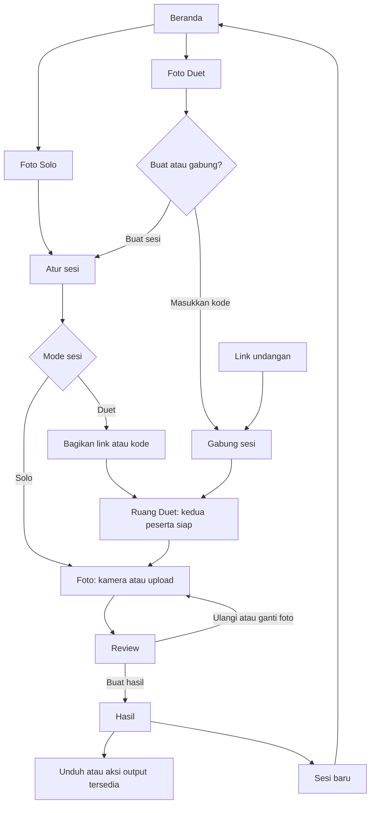

# User flow Solo dan Duet — Stecute

Tanggal: 2026-09-18  
Status: Rancangan UX target berdasarkan arahan produk; belum diimplementasikan  
Rujukan baseline: [PRD](./stecute-prd.md), [production spec](./stecute-production-spec.md), [technical design](./stecute-technical-design.md)

## 1. Arah pengalaman

Pengguna memilih **Foto Solo** atau **Foto Duet**, lalu mengikuti urutan yang konsisten: **Atur sesi → Foto → Review → Hasil**. Kedua mode memiliki pilihan fitur yang sama. Duet menambahkan undangan, koneksi teman, dan koordinasi dua peserta.

Rancangan ini memisahkan dua pilihan yang saat ini tercampur:

- **Mode:** Solo atau Duet.
- **Sumber foto:** Kamera atau Upload foto, dipilih di dalam Atur sesi.

Solo memakai satu perangkat dan tetap offline-first setelah cache siap. Duet mempertemukan tepat dua peserta di perangkat berbeda dan membutuhkan internet selama bergabung serta bertukar media. Tidak ada login, histori cloud, atau unggah otomatis ke galeri publik.

Kesetaraan fitur di dokumen ini adalah target. Upload foto Duet, frame custom Duet, dan koordinasi review yang diusulkan merupakan perluasan baseline. Dokumen produksi tetap menjelaskan baseline sampai implementasi berikutnya menyelaraskan keputusan terkait; rancangan ini tidak menyatakan aplikasi sekarang sudah mendukung semuanya.

## 2. Beranda: satu keputusan awal

Judul: **Mau foto sendiri atau bareng?**

| Pilihan | Penjelasan | Tombol |
|---|---|---|
| Foto Solo | Foto sendiri di perangkatmu. Bisa juga bareng dalam satu kamera. | Mulai Solo |
| Foto Duet | Foto berdua dari tempat berbeda. Terhubung online dari dua perangkat. | Mulai Duet |

Kedua pilihan tampil setara. Status koneksi ditempatkan dekat mode: Solo bisa offline setelah aset siap; Duet perlu internet. `Galeri` menjadi navigasi sekunder. Upload foto berada di Atur sesi agar tidak menjadi mode ketiga yang bersaing dengan Solo/Duet.

Gunakan nama **Solo** dan **Duet** secara konsisten di beranda, judul halaman, bantuan, dan hasil. Istilah internal `booth`, `host`, dan `peer` tidak perlu menjadi nama menu. Dalam petunjuk koordinasi cukup gunakan **pembuat sesi** dan **teman**.

## 3. Diagram utama

Ruang Duet merupakan bagian awal langkah **Foto**, bukan tambahan langkah utama di progress. Penerima undangan langsung masuk ke sesi yang dituju, melihat ringkasan pengaturan, dan tidak diminta memilih mode atau membuat sesi lagi.

## 4. Empat langkah yang dipakai bersama

| Langkah | Isi utama | Aksi utama | Penyesuaian Duet |
|---|---|---|---|
| Atur sesi | Kamera/upload, jumlah pose, frame; timer dan Otomatis untuk kamera | Lanjut | Pembuat sesi menetapkan satu konfigurasi bersama; teman melihat ringkasannya saat bergabung |
| Foto | Preview, efek, overlay, latar, pilih kamera, atau pilih dan atur framing foto upload | Ambil foto / Lanjut ke review | Dua peserta, undangan, status siap, dan hitungan mundur bersama |
| Review | Semua pose dan preview strip, ulang/ganti satu pose atau semua | Buat hasil | Kedua peserta melihat versi foto yang sama dan menyatakan hasil sudah cocok |
| Hasil | Strip final, PNG, Live Cam jika tersedia, aksi output | Unduh PNG | Masing-masing menyimpan hasil ke perangkatnya sendiri |

Progress selalu memakai label **Atur sesi · Foto · Review · Hasil**. Nama mode menjadi badge terpisah agar pengguna tetap tahu sedang di Solo atau Duet.

Atur sesi mengutamakan sumber foto, jumlah pose, dan frame. Pengaturan awal mengikuti default aplikasi, dengan `Classic`, timer `3 detik`, dan `Otomatis` mati. Pengguna dapat langsung lanjut. Efek, overlay, dan latar ditaruh dekat preview agar terlihat hasilnya saat dipilih.

Sebelum foto pertama, pengguna Solo atau pembuat sesi Duet dapat membuka panel inline `Pengaturan sesi` untuk mengubah frame, jumlah pose/layout, timer `3`/`5`/`10` detik, dan Otomatis tanpa mematikan kamera atau keluar ruang. Perubahan menjadi aktif setelah `Terapkan`; `Batal` mempertahankan sesi semula. Setelah foto pertama, seluruh konfigurasi sesi, efek, overlay, dan latar terkunci. Untuk mengubahnya, pengguna menjalankan aksi terpisah `Ulang semua foto` lalu mengonfirmasi penghapusan foto; membatalkan konfirmasi mempertahankan sesi. Reset mempertahankan konfigurasi/latar/kamera dan membuka kembali pengaturan. Di Duet, hanya pembuat sesi yang mereset foto kedua peserta, dalam ruang serta audio yang tetap berjalan. Lihat [aturan produksi bagian 3.6](./stecute-production-spec.md#36-pengaturan-sesi-langsung-di-kamera).

Tata layar kamera mengikuti baseline responsif pada [production spec bagian 3.5](./stecute-production-spec.md#35-tata-layar-kamera-solo-dan-duet): desktop mulai `1024 px` menempatkan preview di kiri dan panel kontrol di kanan, sedangkan layar lebih sempit memakai satu kolom. Penataan capture ini tidak mencakup perluasan fitur atau penyatuan layar Atur Sesi, Review, dan Hasil yang masih diusulkan dalam dokumen ini.

Izin kamera diminta setelah pengguna memilih kamera dan melanjutkan ke langkah Foto. Beranda dan halaman buat/gabung Duet tidak langsung menyalakan kamera. Upload foto tidak meminta kamera atau mikrofon.

## 5. Jalur Solo

### 5.1 Kamera

1. Beranda → `Mulai Solo`.
2. Atur sesi: sumber Kamera, pilih jumlah pose dan frame, atur timer/Otomatis jika diperlukan.
3. `Lanjut` → izin kamera → preview. Pengguna bisa mengganti kamera, efek, overlay, dan latar.
4. `Ambil foto` → countdown → pose tersimpan. Tampilkan `Pose 1 dari 4`, sesuai jumlah slot sebenarnya.
5. Jika Otomatis mati, pengguna memulai pose berikutnya. Jika nyala, pose pertama tetap dimulai manual, lalu pose berikutnya berjalan otomatis. `Batal` menghentikan countdown/rangkaian tanpa membuang pose yang sudah berhasil.
6. Setelah semua pose lengkap → Review. `Ulangi foto ini` mengganti satu pose; `Ulangi semua` meminta konfirmasi sebelum membuang hasil sebelumnya.
7. `Buat hasil` → render lokal → Hasil → unduh atau aksi output yang tersedia.

### 5.2 Upload foto

1. `Mulai Solo` → Atur sesi → pilih `Upload foto`.
2. Pilih jumlah pose dan frame. Timer, Otomatis, dan kontrol kamera tidak ditampilkan pada sumber ini.
3. `Lanjut` → pilih JPG/PNG/WebP, maksimum `10 MB` per file, sesuai jumlah slot.
4. Atur framing tiap foto. Tampilkan jumlah lengkap, misalnya `3 dari 4 foto siap`.
5. Setelah lengkap → Review → `Ganti foto ini` atau `Ganti semua` jika perlu → Buat hasil → Hasil.

Kedua jalur memakai layar Review dan Hasil yang sama. Live Cam membutuhkan rekaman kamera, sehingga tidak ditawarkan untuk upload pada kedua mode.

## 6. Jalur Duet

### 6.1 Pembuat sesi

1. Beranda → `Mulai Duet` → pilih `Buat sesi`. Alternatif `Gabung dengan kode` tersedia di halaman yang sama.
2. Atur sesi dengan pilihan yang sama seperti Solo. Sumber foto berlaku untuk sesi bersama: Kamera atau Upload foto.
3. `Lanjut` → ruang Duet dibuat → link dan kode langsung tersedia. Status: `Menunggu teman bergabung`.
4. Pembuat sesi dapat menyalin undangan sambil menyiapkan kamera atau foto; izin kamera yang belum diberikan tidak menghalangi menyalin link.
5. Setelah teman bergabung, tampilkan dua posisi yang tetap: pembuat sesi di kiri, teman di kanan. Label relatif boleh `Kamu`/`Teman`, tetapi urutan posisi tidak berbalik antarperangkat dan sama dengan hasil akhir.
6. Untuk Kamera, masing-masing menyiapkan kameranya. Pembuat sesi memilih efek, overlay, dan latar bersama. Kedua peserta menekan `Siap` setelah preview dan aset siap.
7. Pembuat sesi menekan `Ambil foto`. Countdown dan nomor pose tampil di kedua perangkat. Satu pose menghasilkan satu pasangan foto dalam satu slot strip.
8. Setelah semua pose lengkap dan diterima kedua perangkat → Review bersama → kedua peserta menyatakan `Sudah cocok` → Hasil.
9. Masing-masing dapat mengunduh dan memakai aksi output sesuai browsernya. Selesainya download satu peserta tidak menutup hasil peserta lain.

### 6.2 Teman yang menerima undangan

1. Buka link → langsung ke ringkasan sesi; atau `Mulai Duet` → masukkan kode → `Lanjut` untuk memeriksa sesi yang dituju.
2. Validasi kode dan ketersediaan tempat sebelum meminta kamera. Jika valid, tampilkan ringkasan sumber, jumlah pose, dan frame.
3. Tampilkan penjelasan sebelum bergabung: `Kamera dan foto sesi akan dibagikan ke temanmu. Hasil disimpan di perangkat masing-masing.` Untuk sumber Upload, sesuaikan copy menjadi foto yang dipilih dan hilangkan klaim kamera.
4. `Gabung sesi` → nyalakan kamera atau pilih foto sesuai sumber bersama. Mikrofon pada sesi kamera opsional; penolakan mikrofon tidak menghalangi foto.
5. `Siap` → status `Menunggu pembuat sesi mengambil foto` → ikut countdown → Review → Hasil yang sama.

### 6.3 Upload foto di Duet — target perluasan

1. Pembuat sesi memilih Upload foto di Atur sesi. Kedua peserta mendapat editor upload yang sama seperti Solo.
2. Masing-masing memilih N foto dan mengatur framing bagiannya. Status menampilkan `Foto kamu: 4/4` dan `Foto teman: 2/4`, bukan hanya indikator koneksi.
3. File asli tetap lokal. Setelah peserta menekan `Siap`, hasil framing yang diperlukan untuk komposisi dibagikan kepada teman untuk sesi tersebut.
4. Foto nomor 1 dari masing-masing peserta dipasangkan dalam slot 1, dan seterusnya. Review baru aktif setelah semua pasangan diterima utuh.
5. `Ganti foto ini` mengubah bagian milik peserta tersebut; bagian teman dan pose lainnya tetap. Perubahan membatalkan persetujuan review sebelumnya pada kedua perangkat.
6. Kedua peserta menyatakan `Sudah cocok` → masing-masing merender dan menyimpan hasil lokal.

Satu sesi memakai satu sumber bersama agar alur mudah dipahami. Kombinasi satu peserta kamera dan satu peserta upload bukan bagian rancangan awal ini. Pilihan Kamera maupun Upload tetap tersedia di Solo dan Duet.

## 7. Koordinasi Duet tanpa membuat teman bingung

Kesetaraan berlaku pada fitur Solo versus Duet. Duet tetap membutuhkan pembagian kontrol agar tidak ada dua countdown atau dua perubahan frame yang berjalan bersamaan.

| Aksi | Pembuat sesi | Teman |
|---|---|---|
| Sumber | Mengatur konfigurasi bersama sebelum foto dimulai | Melihat sumber aktif |
| Jumlah pose, frame, timer, Otomatis | Mengatur di Atur sesi atau panel Pengaturan sesi sebelum foto pertama; semuanya terkunci setelah foto pertama | Melihat konfigurasi setelah diterapkan |
| Ulang semua foto | Mengonfirmasi penghapusan seluruh foto untuk membuka pengaturan kembali, tanpa keluar ruang | Foto sesi ikut di-reset; konfigurasi aktif, koneksi, dan audio tetap |
| Efek, overlay, latar kamera | Memilih treatment bersama sebelum capture | Melihat treatment yang sama diterapkan |
| Pilih kamera/lensa, izin mikrofon, mute/nyalakan mikrofon | Mengatur perangkat sendiri | Mengatur perangkat sendiri |
| Matikan/nyalakan suara teman | Mengatur playback di perangkat sendiri | Mengatur playback di perangkat sendiri |
| Pilih/framing foto upload | Mengatur foto sendiri | Mengatur foto sendiri |
| Kesiapan | Menekan Siap untuk diri sendiri | Menekan Siap untuk diri sendiri |
| Mulai foto | Memulai jika kedua peserta siap | Melihat countdown; dapat membatalkan jika belum siap |
| Ulangi pose kamera | Memulai pengulangan setelah kedua peserta siap | Menandai pose lewat `Minta ulang foto ini`; permintaan terlihat pada kedua layar |
| Review | Menyatakan `Sudah cocok` | Menyatakan `Sudah cocok` |
| Unduh, simpan, bagikan, cetak | Mandiri pada perangkat sendiri | Mandiri pada perangkat sendiri |

Permintaan ulang dari teman harus dapat diterima atau dibatalkan secara jelas sebelum finalisasi. Sesudah semua permintaan selesai dan kedua peserta menyetujui versi review yang sama, sesi dikunci untuk render. Tidak ada penantian persetujuan tanpa keterangan siapa yang belum selesai.

Kontrol mikrofon dan suara teman tersedia selama ruang terbuka, termasuk review dan hasil. Masing-masing hanya mengendalikan mikrofon sendiri dan playback di perangkatnya; host tidak menyalakan mikrofon tamu. Mikrofon aktif jika izin diberikan. Jika izin ditolak, foto tetap bisa dilanjutkan dan aksi `Nyalakan mikrofon` mencoba akses audio kembali tanpa mengulang kamera. Suara live tidak menjadi bagian file hasil.

Perubahan konfigurasi sebelum pose pertama membatalkan status Siap pada rancangan koordinasi ini. Setelah foto pertama, seluruh konfigurasi terkunci: frame, jumlah pose/layout, timer, Otomatis, efek, overlay, dan latar. Pengaturan terbuka kembali hanya setelah aksi terpisah `Ulang semua foto` dikonfirmasi; kamera, konfigurasi aktif, latar, ruang, dan audio tetap dipertahankan. Retake satu pose kamera Duet mengambil ulang pasangan foto pada pose itu, mempertahankan pose lain dan konfigurasi aktif, serta tidak membuka kunci pengaturan.

## 8. Kesetaraan fitur yang dituju

| Fitur | Solo | Duet | Aturan |
|---|---|---|---|
| Jumlah pose 2/3/4/6 | Ya | Ya | Jumlah slot sama; satu slot Duet berisi pasangan peserta |
| Classic, Youth, Mono dan katalog frame kompatibel | Ya | Ya | Pilihan berasal dari katalog yang sama |
| Frame custom / layout bawaan blanko | Ya | Ya, target perluasan | Asset dan koordinat slot harus tersedia di kedua perangkat sebelum siap |
| Kamera atau upload foto | Ya | Ya, target perluasan untuk upload | Sumber terpisah dari mode |
| Pilih kamera/lensa | Sesuai perangkat | Sesuai perangkat masing-masing | Tidak boleh sengaja dihilangkan karena mode Duet |
| Timer dan Otomatis | Untuk kamera | Untuk kamera | Perilaku sama, countdown Duet terkoordinasi |
| Efek, overlay, latar virtual | Untuk kamera | Untuk kamera | Treatment sama di preview, review, hasil |
| Retake satu pose / semua | Ya | Ya | Duet menunggu kesiapan kedua peserta |
| Ganti/framing foto upload | Ya | Ya, target perluasan | Masing-masing mengedit bagian sendiri |
| PNG dan galeri lokal 10 hasil | Ya | Ya | Masing-masing menyimpan secara lokal |
| Live Cam dan unduh videonya | Jika tersedia | Jika tersedia, perlu penyetaraan UI | Video tanpa audio; kegagalan video tetap menghasilkan PNG |
| Simpan, bagikan, cetak | Sesuai browser | Sesuai browser | Keterbatasan berasal dari perangkat, bukan pengurangan fitur Duet |

Frame custom yang digunakan bersama dikirim khusus untuk sesi tersebut dan tidak otomatis menjadi template publik atau koleksi permanen teman. Gambar latar dan frame strip adalah dua fitur berbeda; sinkronisasi gambar latar yang sudah ada tidak berarti sinkronisasi frame custom sudah tersedia.

Live Cam Duet harus memperlihatkan kedua peserta dengan urutan dan treatment yang sama seperti PNG. Jika tidak dapat dihasilkan dengan benar, tampilkan penjelasan singkat dan lanjutkan dengan PNG. Preview video panggilan dan suara live tidak dianggap file hasil rekaman.

## 9. State penting dan pemulihan

| Keadaan | Pesan / tindakan | Data yang dipertahankan |
|---|---|---|
| Offline di beranda | `Duet perlu internet. Solo tetap bisa dipakai.`; first visit yang belum tercache menjelaskan perlu koneksi awal | Konfigurasi dan galeri lokal |
| Kamera ditolak / tidak ditemukan | Panduan izin, `Coba lagi`, atau `Gunakan upload foto` | Konfigurasi; perubahan sumber Duet disepakati sebelum membuang pose |
| Mikrofon ditolak | `Lanjut tanpa suara` | Preview dan kemampuan mengambil foto |
| Kode salah, sesi penuh, atau sesi berakhir | Pesan spesifik, `Masukkan kode lain` atau `Buat sesi` | Input kode agar dapat dikoreksi |
| Teman belum masuk / belum siap | Tampilkan siapa yang ditunggu dan link undangan | Setup; jangan mulai countdown |
| Latar/frame belum diterima | `Menyiapkan latar/frame teman`; retry atau pilih asset bawaan bersama | Pose yang sudah valid; tidak capture dengan asset berbeda |
| Koneksi putus saat countdown | Batalkan countdown dan Otomatis; `Hubungkan kembali` | Pose yang sudah lengkap; jangan simpan setengah pasangan sebagai pose selesai |
| Sambung kembali gagal / sesi kedaluwarsa | `Buat Duet baru` atau `Mulai Solo`; pindah mode hanya lewat pilihan pengguna | Hasil final lokal tetap tersedia; tidak menjanjikan sesi ephemeral selalu bisa dipulihkan |
| Semua foto sudah lengkap dan disetujui sebelum koneksi putus | Lanjut render/unduh lokal dari snapshot yang sudah sama | Seluruh foto yang sudah diterima; tidak menunggu signaling lagi |
| Render gagal | `Coba buat hasil lagi` | Shot dan konfigurasi aktif |
| Galeri penuh / penyimpanan gagal | Tetap tawarkan unduh hasil di memori; jelaskan hasil belum tersimpan di galeri | Render di memori sampai pengguna selesai |
| Keluar saat ada foto belum selesai | Konfirmasi keluar dan jelaskan efek pada sesi/teman | Tidak diam-diam menghapus hasil final yang sudah tersimpan |

Jangan mengubah Duet menjadi Solo secara otomatis ketika teman terputus. Jika pengguna memilih memulai Solo, buat sesi Solo baru dengan konfigurasi yang masih kompatibel; jangan menganggap pasangan foto yang belum lengkap sudah menjadi hasil Solo.

## 10. Hasil, galeri, dan sesi berikutnya

- `Unduh PNG` menjadi aksi utama yang sama pada kedua mode.
- `Unduh Live Cam` muncul bila file video benar-benar tersedia. Simpan, bagikan, dan cetak mengikuti kemampuan browser.
- Pesan `Tersimpan di galeri perangkat ini` hanya muncul setelah penyimpanan lokal berhasil; ini berbeda dari download file ke perangkat.
- Galeri menggabungkan hasil Solo dan Duet dengan penanda mode ringan dan retensi total `10` hasil per perangkat, bukan 10 per mode.
- `Sesi baru` kembali ke pilihan Solo/Duet. Pengaturan terakhir yang kompatibel boleh diingat; kamera dan mikrofon sesi sebelumnya dihentikan. Tidak ada auto-reset.
- Saat meninggalkan Duet, teman menerima status bahwa peserta telah keluar. File hasil yang sudah tersedia di perangkat teman tetap dapat diunduh.

## 11. Perubahan yang diperlukan dari aplikasi sekarang

Audit ini membaca working tree pada 2026-09-18, termasuk perubahan yang sudah ada sebelum rancangan dibuat. Ini inventaris implementasi, bukan laporan pengujian browser.

| Area | Kondisi saat audit | Arah perubahan |
|---|---|---|
| Beranda | Entri Mulai Foto, Foto Duet, dan Upload Lokal terpisah | Dua entri utama Solo/Duet; upload masuk Atur sesi |
| Model pilihan | `SessionConfigView` memakai source camera/upload/booth | Pisahkan mode Solo/Duet dari sumber camera/upload |
| Duet hub | Kamera preview diminta saat halaman dimuat | Tunda izin sampai pengguna memilih sumber Kamera dan masuk Foto |
| Frame Duet | Katalog difilter ke standard; Upload Frame disembunyikan | Samakan katalog dan tambah sinkronisasi frame custom beserta layout |
| Kamera Duet | Tidak memiliki picker kamera seperti Solo | Sediakan kontrol perangkat lokal yang setara |
| Upload Duet | Belum ada alur upload foto berpasangan | Tambahkan kontribusi foto per peserta dan status kelengkapannya |
| Review Duet | Retake dikendalikan pembuat sesi; render dapat dimulai masing-masing | Tambahkan permintaan ulang, persetujuan versi review, dan finalisasi bersama |
| Live Cam Duet | Ada jalur video/preview; tombol unduh belum setara output Solo | Pakai aksi output yang sama jika video tersedia |
| Nama tahap | Label progress dan layar Duet berbeda dari Solo | Samakan empat tahap dan komponen UI yang relevan |

Rujukan implementasi: [LandingView](../src/features/landing/LandingView.vue), [SessionConfigView](../src/features/session-config/SessionConfigView.vue), [FlowProgress](../src/components/common/FlowProgress.vue), [CameraView](../src/features/camera/CameraView.vue), [BoothHubView](../src/features/booth/BoothHubView.vue), [BoothRoomView](../src/features/booth/BoothRoomView.vue), [OutputView](../src/features/output/OutputView.vue).

Saat implementasi, pertahankan link undangan `/j/:code` dan kompatibilitas entri lama. Jalur lokal tidak memuat atau menunggu koneksi Duet. Penyamaan pengalaman tidak memerlukan satu komponen besar; konfigurasi, progress, review, dan output dapat berbagi komponen, sedangkan transport Duet tetap terpisah.

## 12. Kriteria penerimaan rancangan

- Pengguna baru dapat menjelaskan Solo = satu perangkat, Duet = dua perangkat online, sebelum meminta izin kamera.
- Dua orang yang berada di depan satu kamera memahami bahwa mereka dapat memakai Solo.
- Pengguna yang menerima undangan tidak melewati pemilihan mode atau setup ulang.
- Solo Kamera, Solo Upload, Duet Kamera, dan Duet Upload memiliki urutan tahap serta penamaan yang konsisten.
- Tidak ada frame, sumber foto, atau aksi output yang sengaja dibatasi berdasarkan mode; pembatasan capability dijelaskan sesuai sumber/perangkat.
- Pengguna Duet selalu tahu siapa yang belum hadir, belum siap, atau belum menyetujui review.
- Pose tidak dimulai sebelum kedua perangkat dan asset sesi siap. Satu pose Duet dihitung selesai setelah pasangan utuh diterima.
- Retake satu pose tidak menghapus pose lainnya. Pembatalan countdown tidak memicu pose otomatis berikutnya.
- Perubahan foto menghapus persetujuan review lama; hasil final kedua peserta memakai snapshot yang sama.
- Putus koneksi, izin ditolak, kode salah, render gagal, dan storage penuh memiliki aksi pemulihan yang jelas.
- Solo dapat diselesaikan offline setelah cache siap; kegagalan Duet tidak memengaruhi jalur Solo.
- Kesetaraan fitur dinyatakan selesai setelah implementasi dan QA kedua mode, bukan hanya penggantian label beranda.

Sebelum merilis implementasi rancangan ini, selaraskan PRD bagian journey/entry/Booth Bareng, production spec bagian flow dan scope Duet, technical design bagian state/protokol, asset spec untuk frame custom sementara lintas perangkat, release checklist, dan prototype. Rancangan ini tidak menambahkan login, cloud sync permanen, pembayaran, atau ketergantungan server untuk Solo.
